# Architecture Overview

<cite>
**Referenced Files in This Document**
- [Cargo.toml](file://Cargo.toml)
- [velocity-workflow-engine/src/lib.rs](file://velocity-workflow-engine/src/lib.rs)
- [velocity-workflow-engine/src/engine.rs](file://velocity-workflow-engine/src/engine.rs)
- [velocity-workflow-engine/src/vctp_transport.rs](file://velocity-workflow-engine/src/vctp_transport.rs)
- [velocity-workflow-engine/src/vctp_rpc.rs](file://velocity-workflow-engine/src/vctp_rpc.rs)
- [velocity-workflow-core/src/slab.rs](file://velocity-workflow-core/src/slab.rs)
- [velocity-workflow-core/src/bitmask.rs](file://velocity-workflow-core/src/bitmask.rs)
- [velocity-classic-server/src/ws_vctp_gateway.rs](file://velocity-classic-server/src/ws_vctp_gateway.rs)
- [velocity-classic-server/src/http_vctp_ingress.rs](file://velocity-classic-server/src/http_vctp_ingress.rs)
- [tools/vctp-sidecar/src/main.rs](file://tools/vctp-sidecar/src/main.rs)
- [velocity-server-bootstrap/src/lib.rs](file://velocity-server-bootstrap/src/lib.rs)
- [velocity-server-bootstrap/src/auth.rs](file://velocity-server-bootstrap/src/auth.rs)
- [velocity-server-bootstrap/src/tracing_setup.rs](file://velocity-server-bootstrap/src/tracing_setup.rs)
- [velocity-nmcp-protocol/src/lib.rs](file://velocity-nmcp-protocol/src/lib.rs)
- [velocity-workflow-server/src/main.rs](file://velocity-workflow-server/src/main.rs)
- [velocity-classic-server/src/main.rs](file://velocity-classic-server/src/main.rs)
- [velocity-embedded-server/src/main.rs](file://velocity-embedded-server/src/main.rs)
- [proto/bench/v1/bench.proto](file://proto/bench/v1/bench.proto)
- [proto/vctp_service.json](file://proto/vctp_service.json)
- [deploy/helm/velocity/values.yaml](file://deploy/helm/velocity/values.yaml)
</cite>

## Table of Contents
1. [System Architecture](#system-architecture)
2. [Workspace Crates](#workspace-crates)
3. [Engine Flavors](#engine-flavors)
4. [NMCP Protocol Transport](#nmcp-protocol-transport)
5. [VCTP Protocol Transport](#vctp-protocol-transport)
6. [VCTP Gateways and Sidecar Proxy](#vctp-gateways-and-sidecar-proxy)
7. [Slab Engine — Merkle Root State Proof](#slab-engine--merkle-root-state-proof)
8. [Persistence Layers](#persistence-layers)
9. [Security Layer](#security-layer)
10. [Distributed Tracing](#distributed-tracing)
11. [Multi-Instance Coordination](#multi-instance-coordination)
12. [Protocol Buffers and gRPC](#protocol-buffers-and-grpc)
13. [SDK Architecture](#sdk-architecture)
14. [Benchmark Architecture](#benchmark-architecture)
15. [Deployment Architecture](#deployment-architecture)
16. [Data Flow](#data-flow)

## System Architecture

V.E.L.O.C.I.T.Y. is a multi-flavor workflow engine ecosystem designed for high performance, durability, and flexibility. The system is organized into four layers with 15 workspace crates plus VCTP tools and sidecar:

```mermaid
graph TB
    subgraph "Client Layer"
        C1[TypeScript SDK<br/>+ VCTP SDK]
        C2[Python SDK<br/>+ VCTP SDK]
        C3[Go SDK<br/>+ VCTP SDK]
        C4[Java SDK]
    end
    
    subgraph "Gateway Layer"
        GW1[WebSocket-to-VCTP<br/>Gateway]
        GW2[HTTP-to-VCTP<br/>Ingress + Swagger UI]
        GW3[VCTP Sidecar<br/>ECDH + XOR cipher]
    end

    subgraph "Server Layer"
        S1[Velocity Server<br/>gRPC + WAL]
        S2[Velocity Embedded<br/>NMCP + PostgreSQL]
        S3[Velocity Classic<br/>NMCP + WAL/PG]
        S4[VCTP RPC Server<br/>UDP :9090]
    end

    subgraph "Bootstrap Layer"
        B1[velocity-server-bootstrap<br/>auth, rate-limit, audit, tracing, mTLS]
    end
    
    subgraph "Core Engine"
        E1[velocity-workflow-core<br/>Slab Engine + Bitmask256]
        E2[velocity-workflow-engine<br/>WAL, PG adapter, advisory locking, DurabilityConfig]
        E3[velocity-nmcp-protocol<br/>shmem + WebSocket]
    end
    
    subgraph "Persistence Layer"
        P1[WAL Files<br/>group-commit]
        P2[(PostgreSQL)<br/>per-step journal]
        P3[PG Advisory Locks<br/>multi-instance]
    end
    
    C1 --> GW1
    C1 --> GW2
    C2 --> GW1
    C3 --> GW1
    C1 --> S1
    C1 --> S2
    C1 --> S3
    C2 --> S1
    C3 --> S1
    C4 --> S1
    
    GW1 -->|VCTP UDP| S4
    GW2 -->|VCTP UDP| S4
    GW3 -->|VCTP UDP| S4
    
    S1 --> E1
    S2 --> E1
    S3 --> E1
    S4 --> E2
    S1 --> B1
    S2 --> B1
    S3 --> B1
    
    E1 --> E2
    E2 --> E3
    E2 --> P1
    E2 --> P2
    E2 --> P3
```

**Key Design Principles:**
- **Multi-flavor deployment** — Same core engine, different transport and persistence layers
- **Dual transport** — NMCP (shmem + WebSocket) for production, VCTP (UDP) for high-performance RPC
- **Zero-allocation hot paths** — Fixed-size buffers in critical paths
- **Deterministic execution** — Workflow state is fully reproducible with cryptographic proof (Slab Merkle root)
- **Protocol-first design** — gRPC/protobuf for bench-suite, NMCP for production, VCTP for UDP RPC
- **Shared bootstrap** — Auth, rate limiting, audit, tracing extracted to one crate
- **SDK diversity** — Native SDKs for TypeScript, Python, Go, Java — all with VCTP transport support
- **Production hardened** — Chaos tests, mTLS, OpenTelemetry, PG advisory locking, circuit breaker, graceful drain

## Workspace Crates

The workspace contains 15 crates organized by role:

| Crate | Role |
|-------|------|
| `velocity-workflow-core` | Core abstractions, FFI slab engine, Bitmask256 |
| `velocity-workflow-engine` | Engine implementation (WAL, PG adapter, advisory locking, DurabilityConfig, VCTP transport + RPC) |
| `velocity-workflow-daemon` | Background daemon process |
| `velocity-nmcp-protocol` | NMCP binary protocol (frame, shmem, WebSocket) |
| `velocity-server-bootstrap` | Shared server init, auth, rate-limit, audit, tracing, mTLS |
| `velocity-workflow-server` | gRPC server with WAL (original flavor) |
| `velocity-classic` | Classic engine library (NMCP router) |
| `velocity-classic-server` | Classic server binary (NMCP shmem + WebSocket, VCTP gateways) |
| `velocity-embedded` | Embedded engine library (NMCP router + PostgreSQL) |
| `velocity-embedded-server` | Embedded server binary (NMCP + PostgreSQL) |
| `velocity-bench` | HTTP benchmark tool |
| `velocity-dev-server` | Development server |
| `velocity-test-framework` | Integration test framework |
| `prod-bench` | Production benchmark suite (bench-suite/) |
| `velocity-bench-server` | gRPC benchmark service (bench-suite/) |

### VCTP Tools (separate workspace)

| Tool | Path | Role |
|------|------|------|
| `vctp-sidecar` | `tools/vctp-sidecar/` | TLS/crypto offload sidecar proxy (ECDH + XOR cipher) |
| `vctp-cli` | `tools/vctp-cli/` | Python CLI for VCTP server operations |
| `vctp-wireshark` | `tools/vctp-wireshark/` | Wireshark Lua dissector for packet inspection |
| `vctp-openapi` | `tools/vctp-openapi/` | OpenAPI 3.0.3 spec generator |

## Engine Flavors

### Velocity Server (Single Binary)

The production gRPC server with Write-Ahead Log persistence. Optimized for maximum throughput.

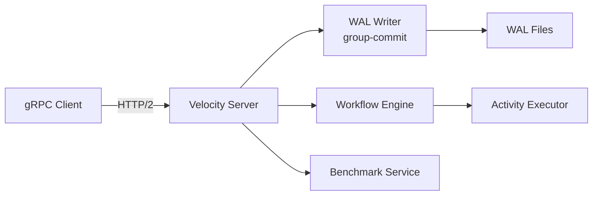

**Characteristics:**
- **Protocol:** gRPC (HTTP/2) via BenchmarkService
- **Persistence:** WAL with background group-commit thread
- **Port:** 7234 (default), 17234 (Docker)
- **Memory:** ~98 MiB
- **Throughput:** ~43.6 ops/s (simple workflow)
- **Use case:** Maximum throughput, simple deployment, bench-suite integration

**Key files:**
- `velocity-workflow-server/src/main.rs` — Server entry point
- Uses `WorkflowEngine` with WAL backend
- Implements `BenchmarkService` proto

### Velocity Embedded

NMCP-based server with PostgreSQL persistence and per-step journal. Best balance of performance and durability.

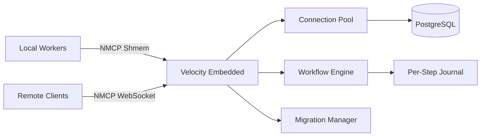

**Characteristics:**
- **Protocol:** NMCP (shmem + WebSocket)
- **Persistence:** WAL + PostgreSQL (per-step journal)
- **Port:** 8084 (WebSocket default)
- **Memory:** ~1.25 MiB (server) + ~68 MiB (PostgreSQL)
- **Throughput:** ~61.25 ops/s (simple workflow)
- **Use case:** Embedded deployments, ACID transactions, SQL queries

**Key files:**
- `velocity-embedded-server/src/main.rs` — Server entry point
- `velocity-embedded/src/main.rs` — Engine library with NMCP router
- Uses `async-pg` for PostgreSQL connection pooling

### Velocity Classic

Rust server with NMCP transport. Replaced the original TypeScript engine. Supports Temporal-compatible API patterns.

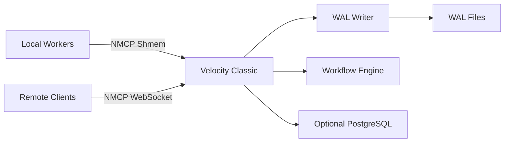

**Characteristics:**
- **Protocol:** NMCP (shmem + WebSocket)
- **Persistence:** WAL + optional PostgreSQL
- **Port:** 8083 (WebSocket default)
- **Memory:** ~9.23 MiB
- **Throughput:** ~61.54 ops/s (simple workflow)
- **Use case:** Temporal migration patterns, low-latency workflows
- **Note:** Replaced TypeScript engine with Rust (commit 2bae043)

**Key files:**
- `velocity-classic-server/src/main.rs` — Server entry point
- `velocity-classic/src/main.rs` — Engine library with NMCP router
- Uses jemalloc global allocator

## NMCP Protocol Transport

All three flavors (except the original Server) use NMCP (Nano Message Communication Protocol) for inter-process communication:

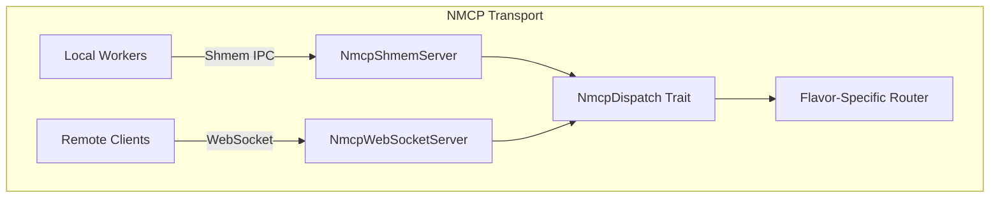

**Key characteristics:**
- **Binary frame format** — 16-byte header + JSON payload
- **Shared memory** — File-backed shmem buffers for local IPC (50-100x faster than HTTP)
- **WebSocket** — TCP-based for remote/cross-machine access
- **TLS support** — Both shmem and WebSocket endpoints support mTLS via rustls
- **NmcpDispatch trait** — Each flavor implements frame dispatch via its NmcpFrameRouter

## VCTP Protocol Transport

VCTP (Velocity Transfer Protocol) is a zero-copy UDP-based RPC protocol for high-performance workflow operations. It complements NMCP with a connectionless transport optimized for low-latency, high-throughput scenarios.

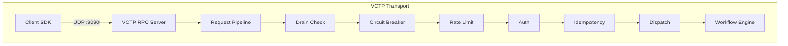

### Wire Format

```
 0                   1                   2                   3
 0 1 2 3 4 5 6 7 8 9 0 1 2 3 4 5 6 7 8 9 0 1 2 3 4 5 6 7 8 9 0 1
+-+-+-+-+-+-+-+-+-+-+-+-+-+-+-+-+-+-+-+-+-+-+-+-+-+-+-+-+-+-+-+-+
|             Magic (0x50544356)                                |
+-+-+-+-+-+-+-+-+-+-+-+-+-+-+-+-+-+-+-+-+-+-+-+-+-+-+-+-+-+-+-+-+
|             Sequence Number                                   |
+-+-+-+-+-+-+-+-+-+-+-+-+-+-+-+-+-+-+-+-+-+-+-+-+-+-+-+-+-+-+-+-+
|             Workflow ID                                       |
+-+-+-+-+-+-+-+-+-+-+-+-+-+-+-+-+-+-+-+-+-+-+-+-+-+-+-+-+-+-+-+-+
|             Slab Offset (frag index / total)                  |
+-+-+-+-+-+-+-+-+-+-+-+-+-+-+-+-+-+-+-+-+-+-+-+-+-+-+-+-+-+-+-+-+
|             Payload Length                                    |
+-+-+-+-+-+-+-+-+-+-+-+-+-+-+-+-+-+-+-+-+-+-+-+-+-+-+-+-+-+-+-+-+
|             Payload (JSON)                                    |
+-+-+-+-+-+-+-+-+-+-+-+-+-+-+-+-+-+-+-+-+-+-+-+-+-+-+-+-+-+-+-+-+
|             CRC32 Checksum                                    |
+-+-+-+-+-+-+-+-+-+-+-+-+-+-+-+-+-+-+-+-+-+-+-+-+-+-+-+-+-+-+-+-+
```

- **Header size:** 28 bytes (fixed)
- **Max payload:** 65,479 bytes (fits in single UDP datagram)
- **Checksum:** CRC32 for integrity verification
- **Default port:** 9090

### Request Pipeline

Every VCTP request passes through a full processing pipeline:

1. **Drain check** — Reject with 503 if server is draining
2. **Circuit breaker** — Closed/Open/HalfOpen states, trips on max_inflight
3. **Rate limit** — Token bucket per client
4. **Authentication** — JWT bearer or API key
5. **Idempotency** — Deduplicate by sequence number
6. **Inflight tracking** — Track concurrent requests per client
7. **Dispatch** — Route to method handler (start_workflow, signal, query, etc.)

### Key Features

- **Circuit breaker** — Three states (Closed/Open/HalfOpen), cooldown timer
- **Heartbeat** — 30s interval, per-client tracking, 90s eviction timeout
- **Graceful drain** — `begin_drain()` → 503 for new requests → K8s preStop hook sleeps drainTimeoutSeconds
- **Reorder buffer** — BTreeMap-based in-order delivery for sequenced packets
- **AIMD congestion control** — Additive increase, multiplicative decrease
- **Packet fragmentation** — Large payloads split across multiple UDP datagrams
- **Prometheus metrics** — Standard text format export
- **OpenTelemetry tracing** — Spans for every pipeline stage

### Performance

| Benchmark | Result |
|-----------|--------|
| Full-stack dispatch | 9,052 ops/s (UDP + WAL + DB) |
| Full-stack start_workflow | 7,375 ops/s |
| WAL durability write | 7,962 wf/s |
| WAL crash recovery | 43,113 wf/s |

## VCTP Gateways and Sidecar Proxy

Protocol bridge gateways allow clients using standard protocols (WebSocket, HTTP) to connect to the VCTP RPC server:

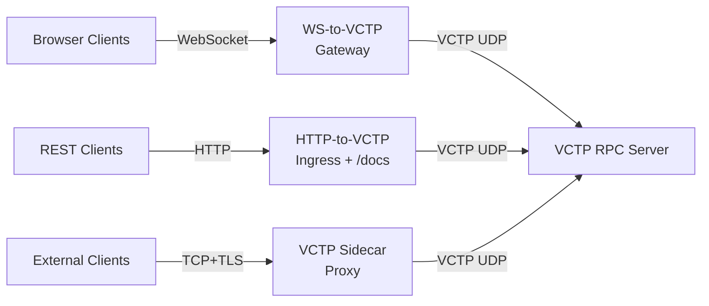

### WebSocket-to-VCTP Gateway

**Path:** `velocity-classic-server/src/ws_vctp_gateway.rs` (592 lines)

Bridges browser-based WebSocket clients to the VCTP UDP backend. Handles WebSocket frame parsing, VCTP packet encapsulation, and bidirectional forwarding.

### HTTP-to-VCTP Ingress

**Path:** `velocity-classic-server/src/http_vctp_ingress.rs` (666 lines)

REST API gateway with auto-generated Swagger UI at `/docs`. Translates HTTP requests to VCTP UDP calls and returns JSON responses.

### VCTP Sidecar Proxy

**Path:** `tools/vctp-sidecar/src/main.rs` (474 lines)

Crypto offload proxy for external connections. Uses ECDH key exchange for session establishment and XOR cipher for payload encryption. Runs as a separate binary with its own Cargo workspace.

## Slab Engine — Merkle Root State Proof

The slab engine provides cryptographic state verification for workflow execution. Each workflow has a `SlabHeader` with a SHA-256 Merkle root that proves the integrity of the workflow's step completion state.

```mermaid
graph TB
    subgraph "SlabHeader (128 bytes, repr(C))"
        A[magic: u32<br/>VLCT]
        B[schema_version: u32]
        C[workflow_id: u64]
        D[run_id: u64]
        E[current_step: u32]
        F[total_steps: u32]
        G[merkle_root: SHA-256]
        H[step_bitmask: Bitmask256<br/>256-bit O(1) tracking]
        I[reserved: 32 bytes]
    end
    
    A --> G
    B --> G
    C --> G
    D --> G
    E --> G
    F --> G
    H --> G
```

**Key characteristics:**
- **`#[repr(C)]`** binary layout for FFI compatibility and memory-mapped persistence
- **Bitmask256** — `[u64; 4]` = 256 bits, `set_step()` is single bitwise OR (O(1)), `is_step_set()` is single bitwise AND (O(1))
- **Merkle root** — SHA-256 hash of magic + schema + workflow_id + run_id + current_step + total_steps + all bitmask bits
- **Recomputed on every step completion** — Provides cryptographic chain of custody
- **Verification** — `verify_merkle_root()` recomputes and compares; any tampering is detectable

## Security Layer

All servers share a common security layer via `velocity-server-bootstrap`:

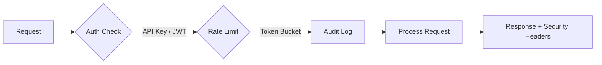

**Components:**
- **Authentication** — API key (X-API-Key) and JWT (HS256/RS256) with zero-downtime key rotation
- **Rate Limiting** — Token bucket per client IP via DashMap (lock-free)
- **Audit Logging** — Structured logs for all API calls
- **mTLS** — TLS certificate + key loading via rustls
- **Security Headers** — `X-Content-Type-Options: nosniff`, `X-Frame-Options: DENY`, `Cache-Control: no-store` on every HTTP response
- **Trivy Scanning** — Container security scanning in CI

## Distributed Tracing

OpenTelemetry-based distributed tracing with optional OTLP export:

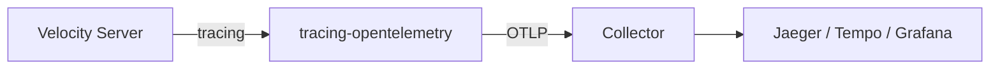

**Span hierarchy:**
- `workflow.execute` — Top-level workflow execution
- `step.persist` — Per-step journal INSERT
- `signal.deliver` — Signal delivery
- `nmcp.dispatch` — NMCP frame dispatch
- `auth.check` — Authentication verification

**Configuration:**
- Optional OTLP export (works without collector in dev mode)
- Configurable sampling rate (0.0 to 1.0)
- Log formats: compact (human-readable) or JSON (production)

## Multi-Instance Coordination

PostgreSQL advisory locks enable safe multi-instance deployments:

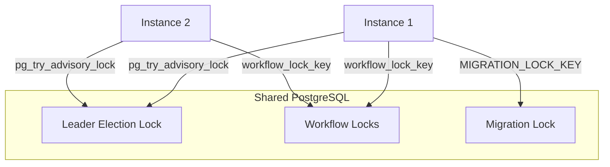

**Lock key space (64-bit):**
- `0xVE00_xxxx` — Leader election (one per role)
- `0xVE10_xxxx` — Workflow processing (one per workflow)
- `0xVE20_0000` — Schema migrations (one global)

**Contention handling:** Non-blocking try → exponential backoff + jitter → retry

## Persistence Layers

### Write-Ahead Log (WAL)

Used by Velocity Server for durable execution.

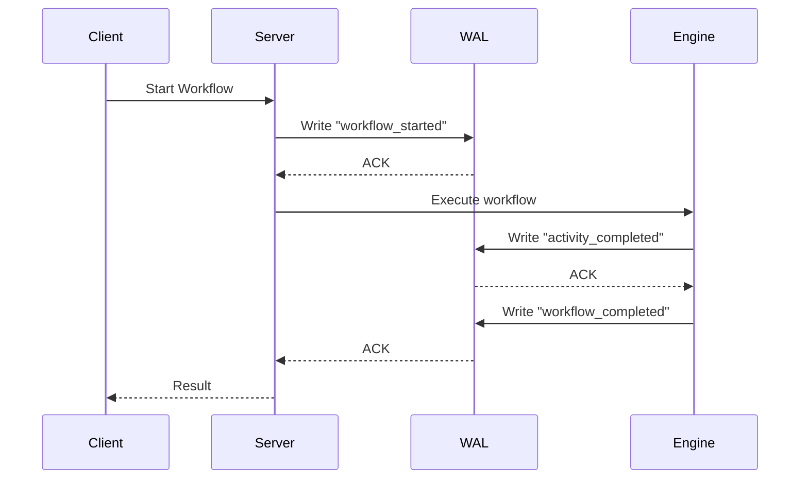

**Characteristics:**
- Append-only log files
- Crash recovery from last committed state
- **Background group-commit thread** — replaces per-operation fsync for better throughput
- **Configurable durability (DurabilityConfig)** — Users pick their safety-throughput trade-off:
  - `strict()` — fsync every step (sync_steps=0, maximum safety, financial transactions)
  - `batched(N, ms)` — fsync every N steps or every ms (balanced, order processing)
  - `async_only(ms)` — background fsync only (max throughput, event processing)
  - `with_direct_execution()` — skip task queue enqueue (caller drives loop, eliminates 2 Mutex + condvar per step)
- Fast writes (sequential I/O)
- No external dependencies

### PostgreSQL

Used by Velocity Embedded for relational durability.

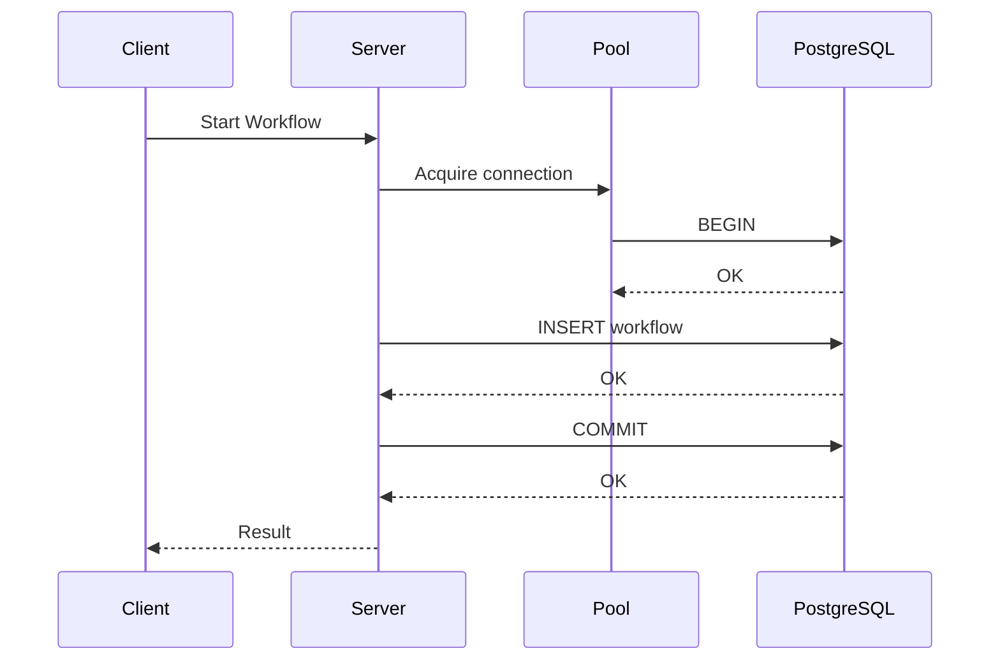

**Characteristics:**
- ACID transactions
- Connection pooling via `deadpool-postgres`
- Automatic schema migrations
- Query optimization via indexes

### In-Memory

Used by Velocity Classic when PostgreSQL is not configured.

**Characteristics:**
- No persistence (data lost on restart)
- Fastest possible execution
- Suitable for development/testing
- Can be configured with WAL + optional PostgreSQL persistence

## Protocol Buffers and gRPC

### Proto Structure

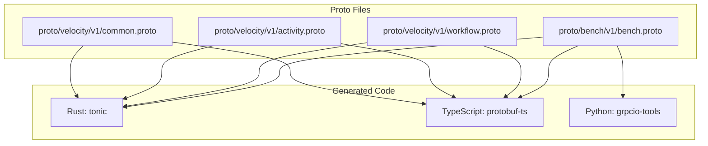

### Benchmark Service Proto

```protobuf
service BenchmarkService {
  // Workflow operations
  rpc StartWorkflow(StartWorkflowRequest) returns (StartWorkflowResponse);
  rpc SignalWorkflow(SignalWorkflowRequest) returns (SignalWorkflowResponse);
  rpc QueryWorkflow(QueryWorkflowRequest) returns (QueryWorkflowResponse);
  rpc CompleteStep(CompleteStepRequest) returns (CompleteStepResponse);
  rpc WaitForCompletion(WaitForCompletionRequest) returns (WaitForCompletionResponse);
  
  // Administrative
  rpc RegisterNamespace(RegisterNamespaceRequest) returns (RegisterNamespaceResponse);
  rpc HealthCheck(HealthCheckRequest) returns (HealthCheckResponse);
}
```

### Code Generation

**Rust (via build.rs):**
```rust
// velocity-workflow-server/build.rs
fn main() -> Result<(), Box<dyn std::error::Error>> {
    tonic_build::configure()
        .build_server(true)
        .build_client(true)
        .compile(&["proto/bench/v1/bench.proto"], &["proto"])?;
    Ok(())
}
```

**TypeScript:**
```bash
cd proto
npx protoc --ts_out . --proto_path . bench/v1/bench.proto
```

## SDK Architecture

All SDKs now support both the legacy HTTP/gRPC transport and the new VCTP UDP transport.

### VCTP SDKs (UDP Transport)

Each SDK includes a `VctpTransport` class that implements the full VCTP client protocol:

| SDK | VCTP Path | Lines |
|-----|-----------|-------|
| TypeScript | `velocity-sdk-typescript/src/vctp-transport.ts` | 358 |
| Python | `velocity-sdk-python/velocity_workflow/vctp.py` | 316 |
| Go | `velocity-sdk-go/vctp/client.go` | 451 |

VCTP SDK API surface: `connect()`, `disconnect()`, `startWorkflow()`, `signalWorkflow()`, `queryWorkflow()`, `cancelWorkflow()`, `terminateWorkflow()`, `describeWorkflow()`.

### TypeScript SDK

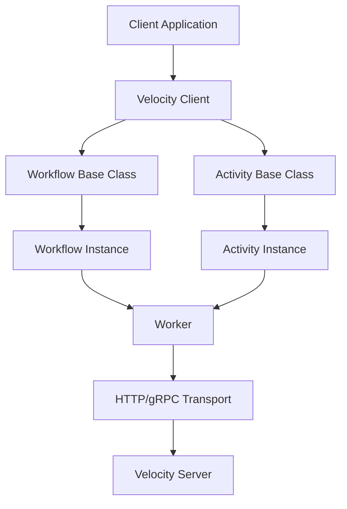

**Key classes:**
- `Worker` — Manages workflow and activity execution
- `Workflow` — Base class for workflow definitions
- `Activity` — Base class for activity implementations
- `VelocityServer` — HTTP server for receiving requests

### Python SDK

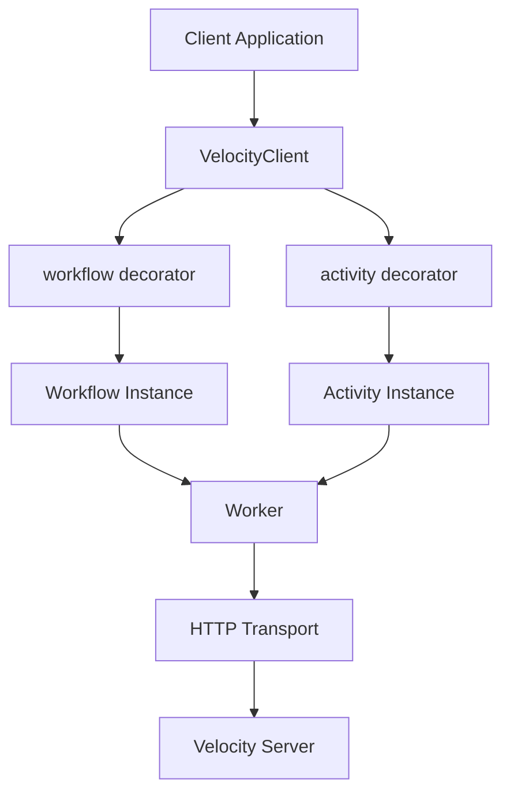

**Key components:**
- `@workflow` — Decorator for workflow functions
- `@activity` — Decorator for activity functions
- `Worker` — Manages execution
- `VelocityClient` — HTTP client

### Go SDK

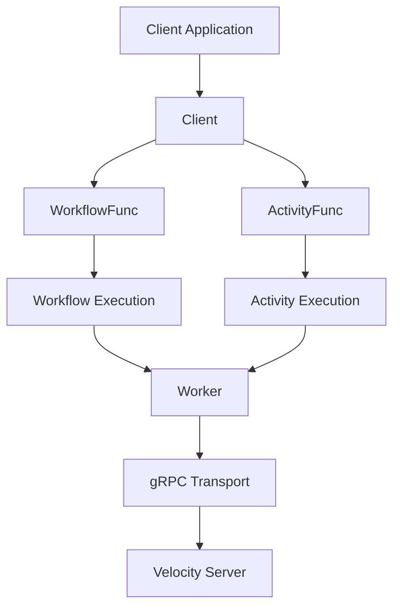

## Benchmark Architecture

### Production Benchmark Suite

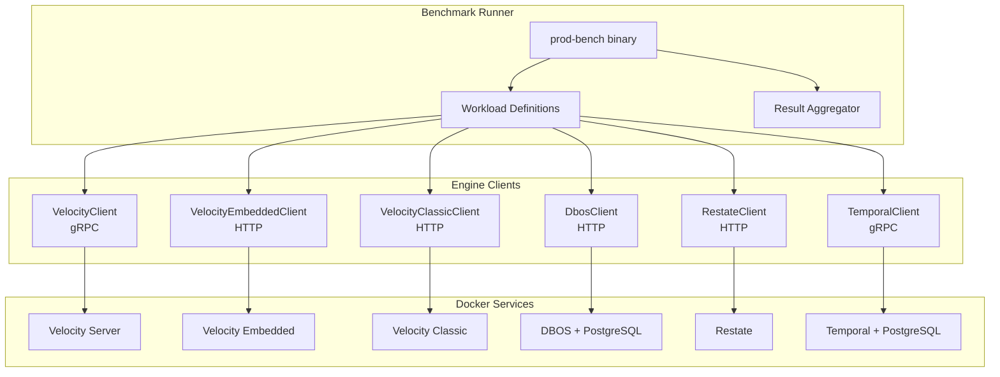

**Workload types:**
- `simple_workflow` — Basic workflow execution
- `signal_storm` — 100 signals per workflow
- `query_burst` — 100 queries per workflow
- `high_step` — 100-step workflow
- `concurrent_100` — 100 concurrent workflows
- `mixed_operations` — Mixed signal/query/complete
- `search_attributes` — Attribute-based queries
- `throughput_ceiling` — Maximum throughput test
- `tail_latency` — Long-running latency test
- `cold_start` — Cold start measurement
- `payload_1kb` — 1KB payload roundtrip
- `invoke` — Lightweight throughput measurement (minimal WAL work)
- `durable_promise` — Durable promise set/get (Restate-compatible camelCase route)
- `keyed_stateful` — Keyed stateful workflow (Restate Virtual Object pattern)
- `keyed_invoke` — Keyed lightweight invocation (Restate Virtual Object pattern)

**C# Lifecycle Benchmarks:**
The `benchmarks/Velocity.Workflow.Benchmarks/` directory contains a .NET benchmark suite (`WorkflowLifecycleBenchmark.cs`) that complements the Rust prod-bench. It measures workflow lifecycle operations using the .NET runtime.

## Deployment Architecture

### Docker Compose (Development)

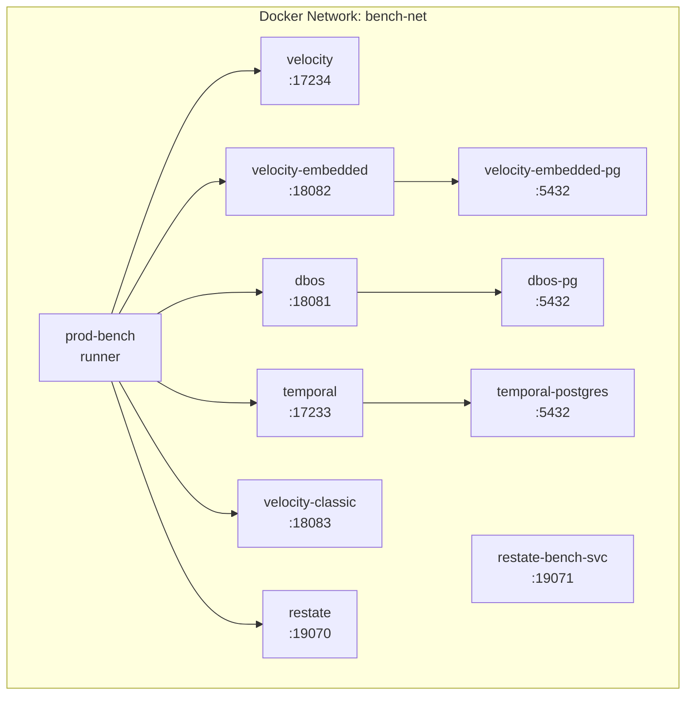

### Kubernetes (Production)

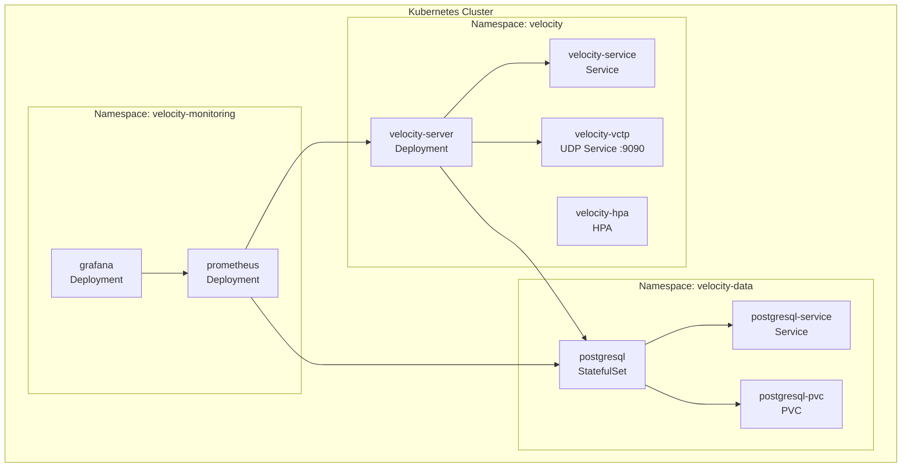

**VCTP K8s Features:**
- **UDP port 9090** exposed via Service for VCTP traffic
- **Health probes** — HTTP liveness/readiness + VCTP exec probe via vctp-cli
- **Graceful drain** — preStop hook sleeps `drainTimeoutSeconds` while in-flight requests complete
- **Helm chart** — `deploy/helm/velocity/` with configurable circuit breaker, heartbeat, security

## Data Flow

### Workflow Execution Flow

```mermaid
sequenceDiagram
    participant Client
    participant Server
    participant Engine
    participant Persistence
    participant Activity
    
    Client->>Server: StartWorkflow
    Server->>Engine: Create workflow instance
    Engine->>Persistence: Save workflow state
    Persistence-->>Engine: ACK
    Engine->>Activity: Execute activity
    Activity-->>Engine: Activity result
    Engine->>Persistence: Update workflow state
    Persistence-->>Engine: ACK
    Engine->>Server: Workflow complete
    Server-->>Client: Result
```

### Signal Flow

```mermaid
sequenceDiagram
    participant Client
    participant Server
    participant Engine
    participant Workflow
    participant Persistence
    
    Client->>Server: SignalWorkflow
    Server->>Engine: Deliver signal
    Engine->>Workflow: Send signal to workflow
    Workflow->>Engine: Process signal
    Engine->>Persistence: Update state
    Persistence-->>Engine: ACK
    Engine->>Server: Signal processed
    Server-->>Client: ACK
```

### Query Flow

```mermaid
sequenceDiagram
    participant Client
    participant Server
    participant Engine
    participant Workflow
    participant Persistence
    
    Client->>Server: QueryWorkflow
    Server->>Engine: Execute query
    Engine->>Workflow: Query current state
    Workflow-->>Engine: Query result
    Engine->>Persistence: Read state if needed
    Persistence-->>Engine: State
    Engine->>Server: Query response
    Server-->>Client: Result
```

## Performance Characteristics

### Throughput Comparison

```mermaid
graph LR
    A[Velocity Embedded<br/>61.25 ops/s] --> B[Velocity Classic<br/>61.54 ops/s]
    B --> C[DBOS<br/>59.59 ops/s]
    C --> D[Velocity Server<br/>43.6 ops/s]
    D --> E[Restate<br/>41.14 ops/s]
    E --> F[Temporal<br/>35.9 ops/s]
```

### Memory Usage

```mermaid
graph LR
    A[Velocity Embedded<br/>1.25 MiB] --> B[Velocity Classic<br/>9.23 MiB]
    B --> C[Velocity Server<br/>98.76 MiB]
    C --> D[DBOS<br/>63.23 MiB]
    D --> E[Restate<br/>200.36 MiB]
    E --> F[Temporal<br/>563 MiB]
```

### Latency (p50)

```mermaid
graph LR
    A[Velocity Classic<br/>14.51ms] --> B[Velocity Embedded<br/>14.65ms]
    B --> C[DBOS<br/>15.52ms]
    C --> D[Restate<br/>23.02ms]
    D --> E[Temporal<br/>176ms]
    E --> F[Velocity Server<br/>180ms]
```

**Section sources**
- [Cargo.toml](file://Cargo.toml)
- [velocity-workflow-engine/src/lib.rs](file://velocity-workflow-engine/src/lib.rs)
- [velocity-workflow-engine/src/engine.rs](file://velocity-workflow-engine/src/engine.rs)
- [velocity-workflow-engine/src/vctp_transport.rs](file://velocity-workflow-engine/src/vctp_transport.rs)
- [velocity-workflow-engine/src/vctp_rpc.rs](file://velocity-workflow-engine/src/vctp_rpc.rs)
- [velocity-workflow-core/src/slab.rs](file://velocity-workflow-core/src/slab.rs)
- [velocity-classic-server/src/ws_vctp_gateway.rs](file://velocity-classic-server/src/ws_vctp_gateway.rs)
- [velocity-classic-server/src/http_vctp_ingress.rs](file://velocity-classic-server/src/http_vctp_ingress.rs)
- [tools/vctp-sidecar/src/main.rs](file://tools/vctp-sidecar/src/main.rs)
- [velocity-server-bootstrap/src/lib.rs](file://velocity-server-bootstrap/src/lib.rs)
- [velocity-server-bootstrap/src/auth.rs](file://velocity-server-bootstrap/src/auth.rs)
- [velocity-server-bootstrap/src/tracing_setup.rs](file://velocity-server-bootstrap/src/tracing_setup.rs)
- [velocity-nmcp-protocol/src/lib.rs](file://velocity-nmcp-protocol/src/lib.rs)
- [velocity-workflow-server/src/main.rs](file://velocity-workflow-server/src/main.rs)
- [velocity-classic-server/src/main.rs](file://velocity-classic-server/src/main.rs)
- [velocity-embedded-server/src/main.rs](file://velocity-embedded-server/src/main.rs)
- [proto/bench/v1/bench.proto](file://proto/bench/v1/bench.proto)
- [proto/vctp_service.json](file://proto/vctp_service.json)
- [deploy/helm/velocity/values.yaml](file://deploy/helm/velocity/values.yaml)
