# Architecture Overview

<cite>
**Referenced Files in This Document**
- [Cargo.toml](file://Cargo.toml)
- [src/lib.rs](file://src/lib.rs)
- [velocity-workflow-server/src/main.rs](file://velocity-workflow-server/src/main.rs)
- [velocity-embedded/src/main.rs](file://velocity-embedded/src/main.rs)
- [velocity-classic-ts/src/index.ts](file://velocity-classic-ts/src/index.ts)
- [velocity-workflow-engine/src/lib.rs](file://velocity-workflow-engine/src/lib.rs)
- [proto/bench/v1/bench.proto](file://proto/bench/v1/bench.proto)
</cite>

## Table of Contents
1. [System Architecture](#system-architecture)
2. [Engine Flavors](#engine-flavors)
3. [Persistence Layers](#persistence-layers)
4. [Protocol Buffers and gRPC](#protocol-buffers-and-grpc)
5. [SDK Architecture](#sdk-architecture)
6. [Benchmark Architecture](#benchmark-architecture)
7. [Deployment Architecture](#deployment-architecture)
8. [Data Flow](#data-flow)

## System Architecture

V.E.L.O.C.I.T.Y. is a multi-flavor workflow engine ecosystem designed for high performance, durability, and flexibility. The system is organized into three layers:

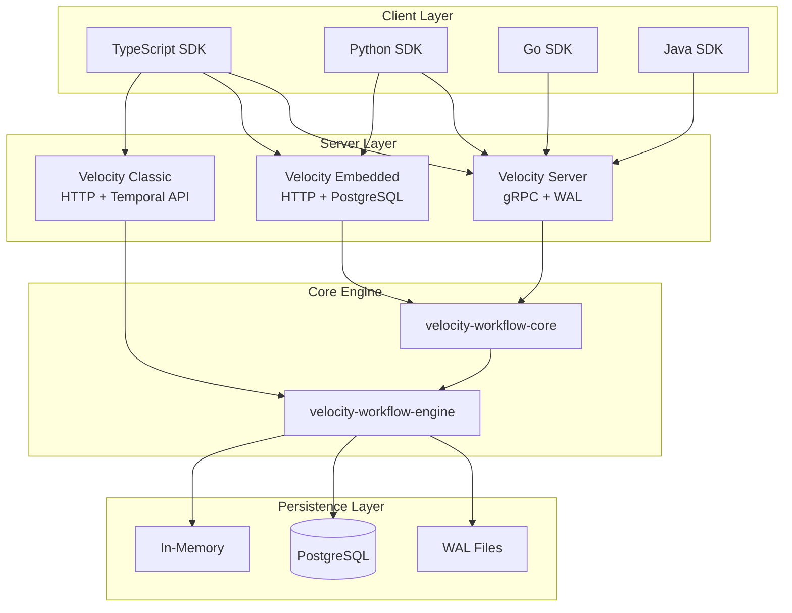

**Key Design Principles:**
- **Multi-flavor deployment** — Same core engine, different persistence and API layers
- **Zero-allocation hot paths** — Fixed-size buffers in critical paths
- **Deterministic execution** — Workflow state is fully reproducible
- **Protocol-first design** — gRPC/protobuf for all inter-service communication
- **SDK diversity** — Native SDKs for TypeScript, Python, Go, Java

## Engine Flavors

### Velocity Server (Single Binary)

The production gRPC server with Write-Ahead Log persistence. Optimized for maximum throughput.

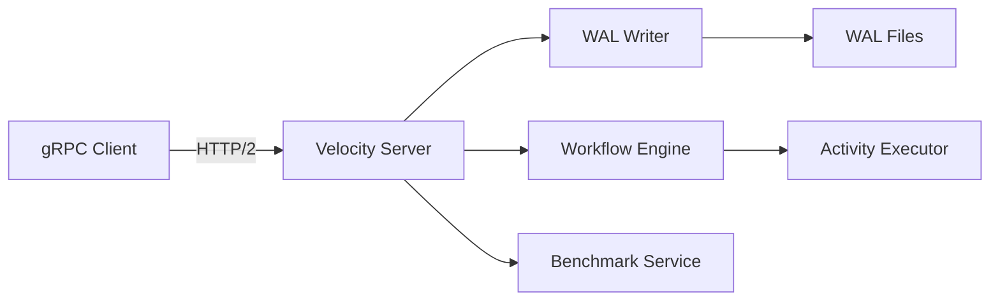

**Characteristics:**
- **Protocol:** gRPC (HTTP/2)
- **Persistence:** Write-Ahead Log (WAL)
- **Port:** 7234 (default), 17234 (Docker)
- **Memory:** ~98 MiB
- **Throughput:** ~43.6 ops/s (simple workflow)
- **Use case:** Maximum throughput, simple deployment

**Key files:**
- `velocity-workflow-server/src/main.rs` — Server entry point
- Uses `WorkflowEngine` with WAL backend
- Implements `BenchmarkService` proto

### Velocity Embedded

PostgreSQL-backed server for embedded deployments. Best balance of performance and durability.

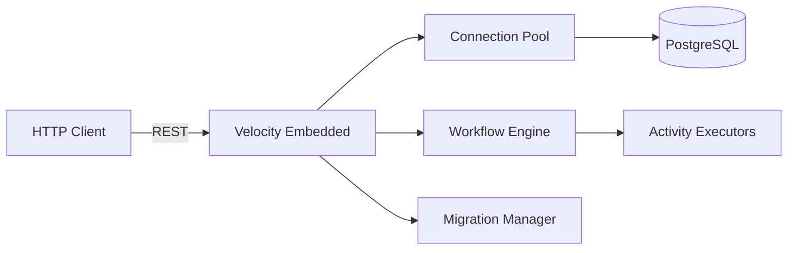

**Characteristics:**
- **Protocol:** HTTP/REST
- **Persistence:** PostgreSQL
- **Port:** 8082 (default), 18082 (Docker)
- **Memory:** ~1.25 MiB (server) + ~68 MiB (PostgreSQL)
- **Throughput:** ~61.25 ops/s (simple workflow)
- **Use case:** Embedded deployments, database durability

**Key files:**
- `velocity-embedded/src/main.rs` — Server entry point
- Uses `async-pg` for PostgreSQL connection pooling
- Implements HTTP endpoints for workflow operations

### Velocity Classic

TypeScript SDK with Temporal-compatible API. Designed for easy migration from Temporal.

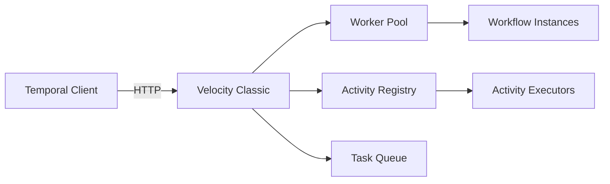

**Characteristics:**
- **Protocol:** HTTP/REST
- **Persistence:** In-Memory (configurable)
- **Port:** 8083 (default), 18083 (Docker)
- **Memory:** ~9.23 MiB
- **Throughput:** ~61.54 ops/s (simple workflow)
- **Use case:** Temporal migration, TypeScript-native workflows

**Key files:**
- `velocity-classic-ts/src/index.ts` — Worker, Workflow, Activity classes
- `velocity-classic-ts/src/main.ts` — Server entry point
- Implements Temporal-compatible API

## Persistence Layers

### Write-Ahead Log (WAL)

Used by Velocity Server for durable execution.

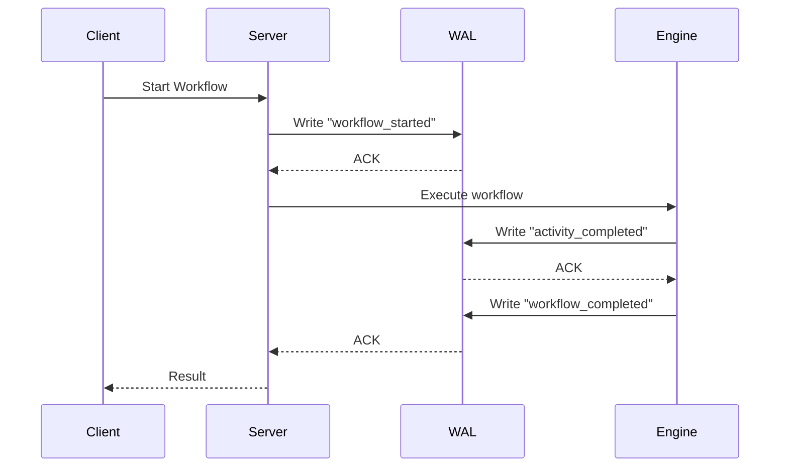

**Characteristics:**
- Append-only log files
- Crash recovery from last committed state
- Fast writes (sequential I/O)
- No external dependencies

### PostgreSQL

Used by Velocity Embedded for relational durability.

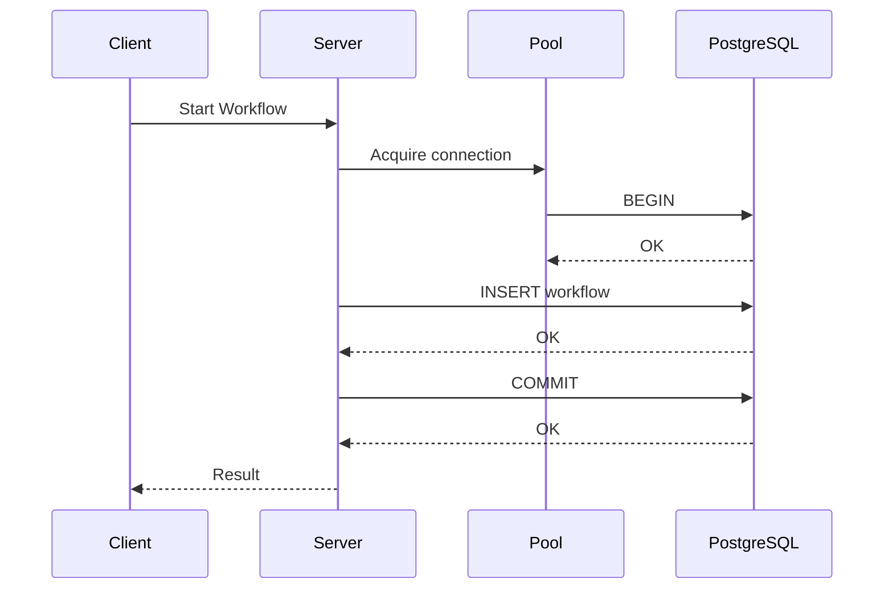

**Characteristics:**
- ACID transactions
- Connection pooling via `deadpool-postgres`
- Automatic schema migrations
- Query optimization via indexes

### In-Memory

Used by Velocity Classic for maximum performance.

**Characteristics:**
- No persistence (data lost on restart)
- Fastest possible execution
- Suitable for development/testing
- Can be configured with external persistence

## Protocol Buffers and gRPC

### Proto Structure

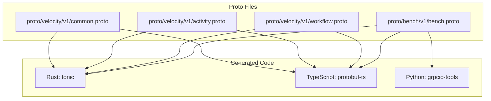

### Benchmark Service Proto

```protobuf
service BenchmarkService {
  // Workflow operations
  rpc StartWorkflow(StartWorkflowRequest) returns (StartWorkflowResponse);
  rpc SignalWorkflow(SignalWorkflowRequest) returns (SignalWorkflowResponse);
  rpc QueryWorkflow(QueryWorkflowRequest) returns (QueryWorkflowResponse);
  rpc CompleteStep(CompleteStepRequest) returns (CompleteStepResponse);
  rpc WaitForCompletion(WaitForCompletionRequest) returns (WaitForCompletionResponse);
  
  // Administrative
  rpc RegisterNamespace(RegisterNamespaceRequest) returns (RegisterNamespaceResponse);
  rpc HealthCheck(HealthCheckRequest) returns (HealthCheckResponse);
}
```

### Code Generation

**Rust (via build.rs):**
```rust
// velocity-workflow-server/build.rs
fn main() -> Result<(), Box<dyn std::error::Error>> {
    tonic_build::configure()
        .build_server(true)
        .build_client(true)
        .compile(&["proto/bench/v1/bench.proto"], &["proto"])?;
    Ok(())
}
```

**TypeScript:**
```bash
cd proto
npx protoc --ts_out . --proto_path . bench/v1/bench.proto
```

## SDK Architecture

### TypeScript SDK

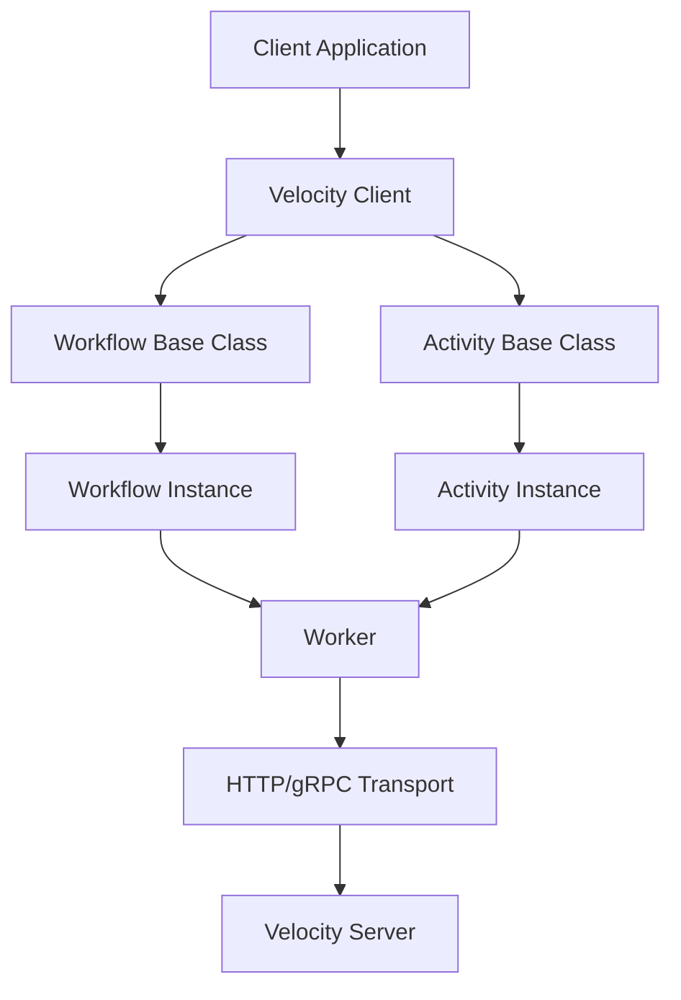

**Key classes:**
- `Worker` — Manages workflow and activity execution
- `Workflow` — Base class for workflow definitions
- `Activity` — Base class for activity implementations
- `VelocityServer` — HTTP server for receiving requests

### Python SDK

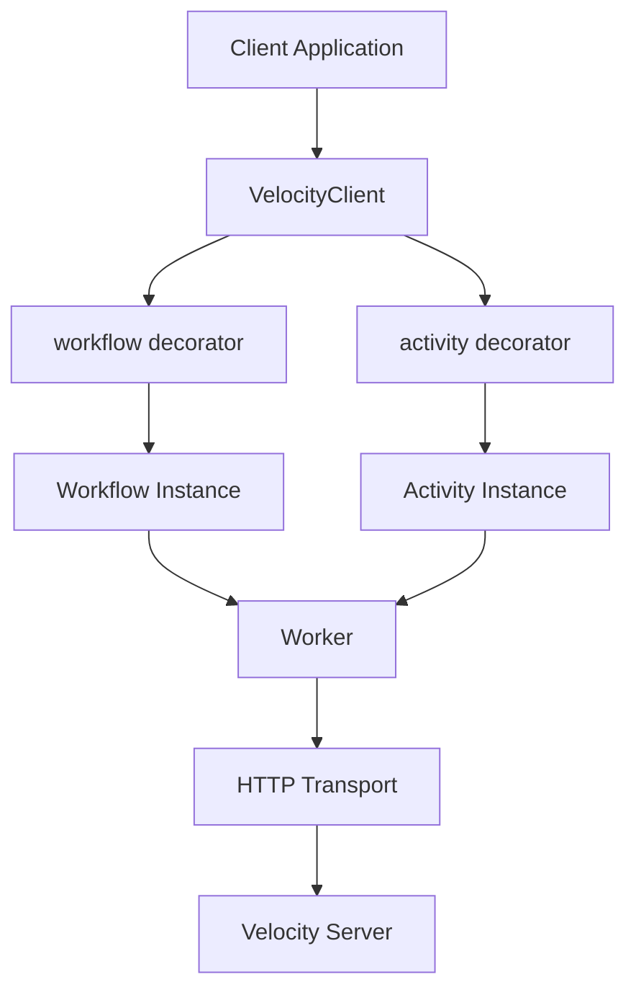

**Key components:**
- `@workflow` — Decorator for workflow functions
- `@activity` — Decorator for activity functions
- `Worker` — Manages execution
- `VelocityClient` — HTTP client

### Go SDK

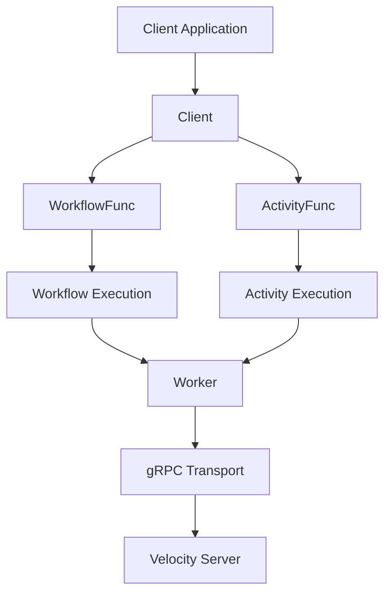

## Benchmark Architecture

### Production Benchmark Suite

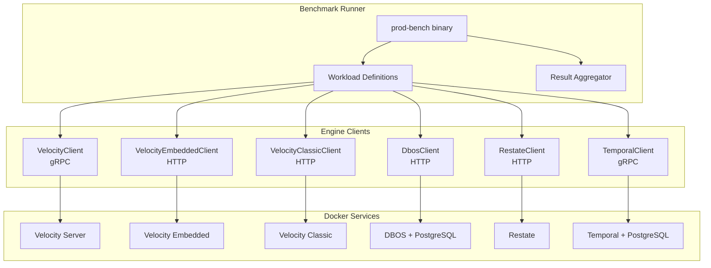

**Workload types:**
- `simple_workflow` — Basic workflow execution
- `signal_storm` — 100 signals per workflow
- `query_burst` — 100 queries per workflow
- `high_step` — 100-step workflow
- `concurrent_100` — 100 concurrent workflows
- `mixed_operations` — Mixed signal/query/complete
- `search_attributes` — Attribute-based queries
- `throughput_ceiling` — Maximum throughput test
- `tail_latency` — Long-running latency test
- `cold_start` — Cold start measurement
- `payload_1kb` — 1KB payload roundtrip

## Deployment Architecture

### Docker Compose (Development)

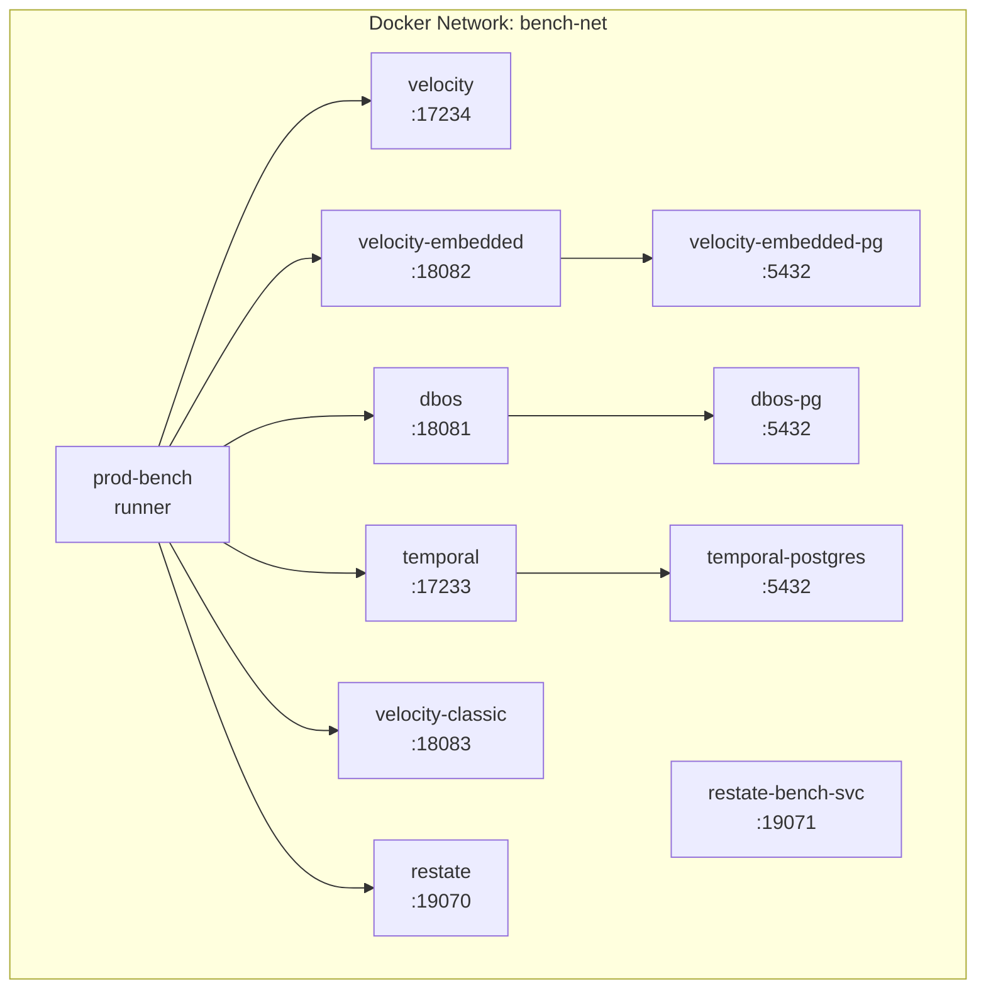

### Kubernetes (Production)

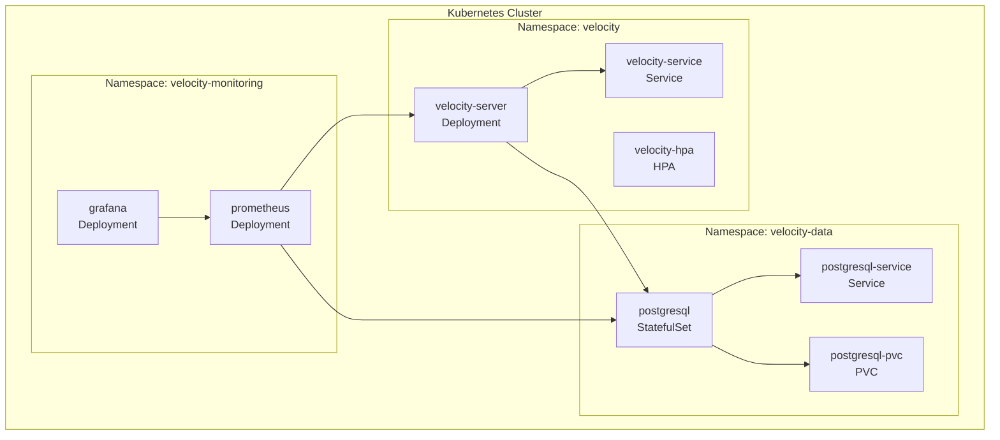

## Data Flow

### Workflow Execution Flow

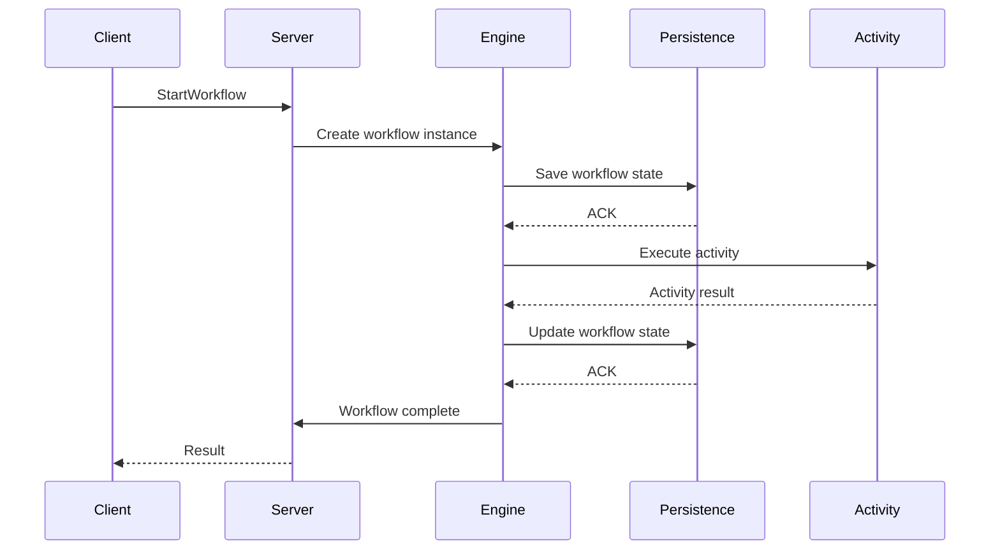

### Signal Flow

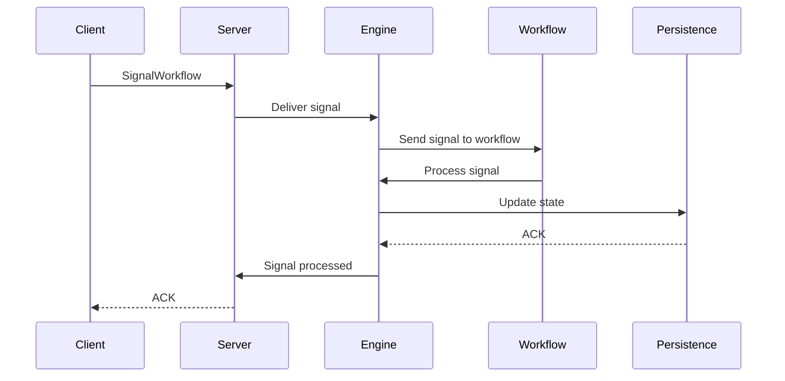

### Query Flow

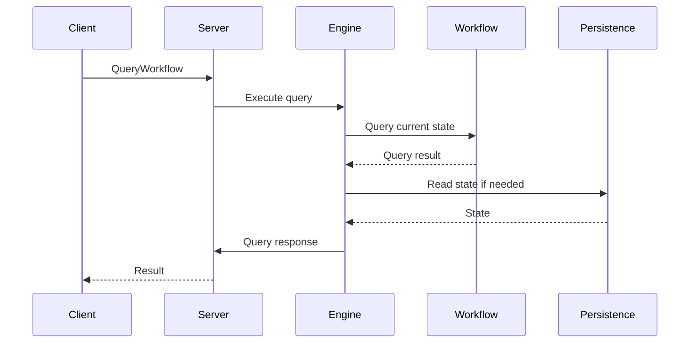

## Performance Characteristics

### Throughput Comparison

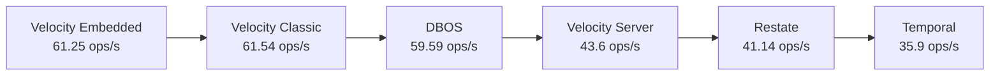

### Memory Usage

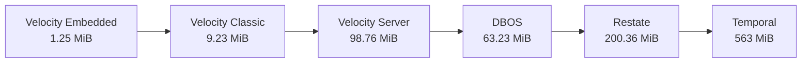

### Latency (p50)

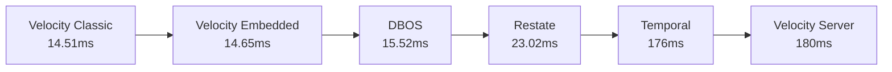

**Section sources**
- [Cargo.toml](file://Cargo.toml)
- [src/lib.rs](file://src/lib.rs)
- [velocity-workflow-server/src/main.rs](file://velocity-workflow-server/src/main.rs)
- [velocity-embedded/src/main.rs](file://velocity-embedded/src/main.rs)
- [velocity-classic-ts/src/index.ts](file://velocity-classic-ts/src/index.ts)
- [proto/bench/v1/bench.proto](file://proto/bench/v1/bench.proto)
