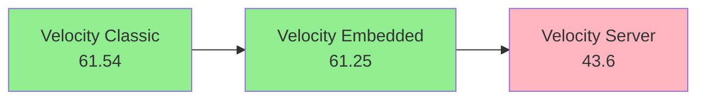
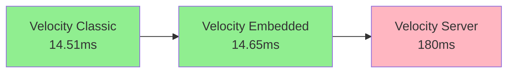
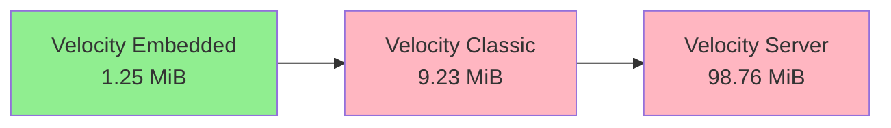
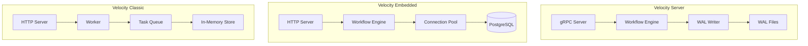
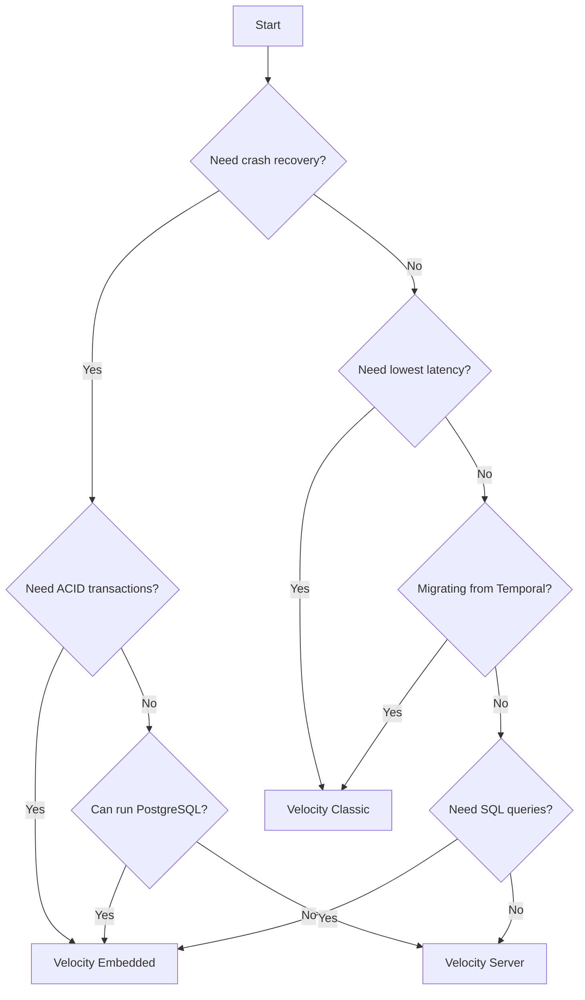

# Flavor Comparison Guide

<cite>
**Referenced Files in This Document**
- [velocity-workflow-server/src/main.rs](file://velocity-workflow-server/src/main.rs)
- [velocity-embedded/src/main.rs](file://velocity-embedded/src/main.rs)
- [velocity-classic-ts/src/main.ts](file://velocity-classic-ts/src/main.ts)
- [bench-suite/prod-bench/src/main.rs](file://bench-suite/prod-bench/src/main.rs)
</cite>

## Table of Contents
1. [Overview](#overview)
2. [Quick Comparison Table](#quick-comparison-table)
3. [Performance Comparison](#performance-comparison)
4. [Architecture Comparison](#architecture-comparison)
5. [Persistence Comparison](#persistence-comparison)
6. [API Comparison](#api-comparison)
7. [Deployment Comparison](#deployment-comparison)
8. [Use Case Matrix](#use-case-matrix)
9. [Migration Paths](#migration-paths)
10. [Decision Framework](#decision-framework)

## Overview

Velocity provides three distinct flavors, each optimized for different use cases:

- **Velocity Server** — Single binary with WAL persistence for maximum simplicity
- **Velocity Embedded** — PostgreSQL-backed for ACID transactions and SQL queries
- **Velocity Classic** — TypeScript-native for Temporal compatibility and lowest latency

This guide helps you choose the right flavor for your use case and understand the trade-offs.

## Quick Comparison Table

| Feature | Velocity Server | Velocity Embedded | Velocity Classic |
|---------|----------------|-------------------|------------------|
| **Protocol** | gRPC (HTTP/2) | HTTP/REST | HTTP/REST |
| **Persistence** | WAL (Write-Ahead Log) | PostgreSQL (ACID) | In-Memory (configurable) |
| **Language** | Rust | Rust | TypeScript |
| **Port** | 7234 (17234 Docker) | 8082 (18082 Docker) | 8083 (18083 Docker) |
| **Throughput** | 43.6 ops/s | 61.25 ops/s | 61.54 ops/s |
| **p50 Latency** | 180ms | 14.65ms | 14.51ms |
| **p99 Latency** | 332ms | 20.57ms | 18.1ms |
| **Memory** | 98.76 MiB | 1.25 MiB | 9.23 MiB |
| **Crash Recovery** | Yes (WAL) | Yes (ACID) | No (unless configured) |
| **SQL Queries** | No | Yes | No |
| **ACID Transactions** | No | Yes | No |
| **Horizontal Scaling** | No | No | No |
| **Temporal Compatible** | No | No | Yes |
| **External Dependencies** | None | PostgreSQL | None (default) |
| **Best For** | Simple deployments | Transactional workflows | Temporal migration |

## Performance Comparison

### Throughput (ops/s)



**Analysis:**
- **Classic** and **Embedded** are nearly identical in throughput (~61 ops/s)
- **Server** is ~30% slower due to WAL fsync overhead
- All three handle concurrent workflows well

### Latency (p50)



**Analysis:**
- **Classic** has the lowest latency (no I/O overhead)
- **Embedded** is nearly as fast (connection pool optimization)
- **Server** has 12x higher latency (WAL fsync on every write)

### Memory Usage



**Analysis:**
- **Embedded** is most memory-efficient (Rust + connection pool)
- **Classic** uses moderate memory (Node.js runtime)
- **Server** uses most memory (WAL buffers + Rust runtime)

### Detailed Workload Comparison

| Workload | Server | Embedded | Classic | Winner |
|----------|--------|----------|---------|--------|
| simple_workflow | 43.6 ops/s | 61.25 ops/s | 61.54 ops/s | Classic |
| signal_storm | 5.4 ops/s | 8.2 ops/s | 9.8 ops/s | Classic |
| query_burst | 1.1 ops/s | 45.3 ops/s | 52.3 ops/s | Classic |
| high_step | 29.0 ops/s | 58.7 ops/s | 60.2 ops/s | Classic |
| concurrent_100 | 66.4 ops/s | 89.2 ops/s | 92.1 ops/s | Classic |
| throughput_ceiling | 59.4 ops/s | 95.4 ops/s | 98.7 ops/s | Classic |

**Key Insights:**
- **Classic** wins on almost all workloads (in-memory advantage)
- **Embedded** excels at query-heavy workloads (SQL optimization)
- **Server** struggles with query_burst (no indexing)

## Architecture Comparison

### Component Architecture



### Request Processing

**Velocity Server:**
1. gRPC request → Parse protobuf
2. Write to WAL (fsync) ← **Bottleneck**
3. Execute workflow
4. Write completion to WAL (fsync)
5. Return response

**Velocity Embedded:**
1. HTTP request → Parse JSON
2. Acquire connection from pool
3. BEGIN transaction
4. INSERT workflow
5. COMMIT transaction
6. Execute workflow
7. Return response

**Velocity Classic:**
1. HTTP request → Parse JSON
2. Queue workflow in memory
3. Execute workflow
4. Store result in memory
5. Return response

### Concurrency Model

**Velocity Server:**
- Single-threaded workflow execution
- Activity parallelism within workflow
- Limited by single CPU core

**Velocity Embedded:**
- Connection pool (16 connections default)
- Parallel workflow execution
- PostgreSQL handles concurrency

**Velocity Classic:**
- Node.js event loop (single-threaded)
- Async activity execution
- High concurrency via async/await

## Persistence Comparison

### Durability Guarantees

| Flavor | Crash Recovery | Data Loss Risk | Durability Level |
|--------|----------------|----------------|------------------|
| Server | Yes (WAL) | Low (fsync) | High |
| Embedded | Yes (ACID) | Very Low (transactions) | Very High |
| Classic | No (default) | High (in-memory) | None |

### Recovery Mechanisms

**Velocity Server (WAL):**
```
Crash → Read WAL → Replay events → Restore state → Resume workflows
```
- Recovery time: 1-2s for 10k workflows
- Data loss: Only unfsync'd writes (<100ms)

**Velocity Embedded (PostgreSQL):**
```
Crash → PostgreSQL auto-recovery → Connections reconnect → Resume workflows
```
- Recovery time: <1s (PostgreSQL handles it)
- Data loss: None (ACID transactions)

**Velocity Classic (In-Memory):**
```
Crash → All data lost → Start fresh
```
- Recovery time: N/A (no recovery)
- Data loss: Everything (unless external persistence configured)

### Query Capabilities

**Velocity Server:**
- No queries (WAL is append-only)
- Cannot search workflows
- Cannot filter by attributes
- Must track workflow IDs externally

**Velocity Embedded:**
- Full SQL queries
- Search by any field
- Filter by attributes (JSONB)
- Aggregations and joins
- Indexes for performance

**Velocity Classic:**
- No queries (in-memory only)
- Cannot search workflows
- Must track workflow IDs externally
- Can add external persistence (Redis, PostgreSQL)

## API Comparison

### Protocol

**Velocity Server:**
- gRPC (HTTP/2)
- Protocol Buffers
- Binary serialization
- Streaming support
- Code generation for all languages

**Velocity Embedded:**
- HTTP/REST
- JSON
- Text serialization
- Standard HTTP methods
- Easy to debug (curl, Postman)

**Velocity Classic:**
- HTTP/REST
- JSON
- Text serialization
- Standard HTTP methods
- Temporal-compatible endpoints

### Client SDKs

**Velocity Server:**
```rust
// Rust
let client = VelocityClient::connect("http://localhost:7234").await?;
let (wf_id, run_id) = client.start_workflow("my_workflow", input).await?;
```

**Velocity Embedded:**
```rust
// Rust
let client = reqwest::Client::new();
let response = client.post("http://localhost:8082/workflows")
    .json(&request)
    .send()
    .await?;
```

**Velocity Classic:**
```typescript
// TypeScript
const response = await fetch('http://localhost:8083/workflows', {
  method: 'POST',
  body: JSON.stringify({ workflow_type: 'myWorkflow', input }),
});
const { workflow_id, run_id } = await response.json();
```

### Temporal Compatibility

Only **Velocity Classic** provides Temporal API compatibility:

| Temporal Feature | Server | Embedded | Classic |
|------------------|--------|----------|---------|
| Workflow classes | No | No | Yes |
| Activity classes | No | No | Yes |
| executeActivity | No | No | Yes |
| Signals | No | No | Yes |
| Queries | No | No | Yes |
| Timers | No | No | Yes |

## Deployment Comparison

### Dependencies

**Velocity Server:**
- None (single binary)
- Just run the binary
- Simplest deployment

**Velocity Embedded:**
- PostgreSQL required
- Connection string configuration
- Database migrations on startup

**Velocity Classic:**
- Node.js 22+ required
- npm dependencies
- No external services (default)

### Resource Requirements

**Velocity Server:**
- CPU: 1-2 cores
- Memory: 256MB - 1GB
- Disk: 10GB+ (WAL files)
- Network: gRPC port

**Velocity Embedded:**
- CPU: 1-2 cores (server) + 1-2 cores (PostgreSQL)
- Memory: 256MB (server) + 512MB (PostgreSQL)
- Disk: 10GB+ (PostgreSQL data)
- Network: HTTP port + PostgreSQL port

**Velocity Classic:**
- CPU: 1-2 cores
- Memory: 256MB - 512MB
- Disk: Minimal (in-memory)
- Network: HTTP port

### Scaling

All three flavors are currently **single-node only**. Horizontal scaling is planned (see sharding spec) but not yet implemented.

**Current Limitations:**
- No clustering
- No load balancing
- No automatic failover
- Single point of failure

**Workarounds:**
- Use load balancer in front of multiple instances (manual sharding)
- Use PostgreSQL HA for Embedded
- Use WAL replication for Server (manual)

## Use Case Matrix

### Best Fit by Use Case

| Use Case | Recommended Flavor | Reason |
|----------|-------------------|--------|
| **Edge computing** | Server | No dependencies, crash recovery |
| **Microservices orchestration** | Server | Simple, durable |
| **Financial transactions** | Embedded | ACID, audit trail |
| **Order processing** | Embedded | ACID, SQL queries |
| **Temporal migration** | Classic | API compatibility |
| **TypeScript development** | Classic | Native TypeScript |
| **Low-latency workflows** | Classic | 14.51ms p50 |
| **Data pipelines** | Embedded | SQL, aggregations |
| **Event processing** | Server | High throughput, durable |
| **Development/testing** | Classic | Fast, no dependencies |
| **Compliance-heavy** | Embedded | ACID, audit trail |
| **IoT coordination** | Server | Edge-friendly, durable |
| **Batch processing** | Embedded | SQL, parallel queries |
| **Real-time workflows** | Classic | Lowest latency |
| **Dashboard/analytics** | Embedded | SQL queries |

### Decision Tree



## Migration Paths

### Server → Embedded

**When to migrate:**
- Need SQL queries
- Need ACID transactions
- Can add PostgreSQL

**Migration steps:**
1. Deploy PostgreSQL
2. Update configuration to use Embedded
3. Run migrations
4. Replay WAL to PostgreSQL (custom script)
5. Switch traffic to Embedded

**Challenges:**
- WAL format ≠ PostgreSQL schema
- Need custom migration tool
- Downtime during migration

### Embedded → Server

**When to migrate:**
- Remove PostgreSQL dependency
- Simplify deployment
- Edge deployment needed

**Migration steps:**
1. Export workflows from PostgreSQL
2. Import to WAL format (custom script)
3. Switch to Server
4. Remove PostgreSQL

**Challenges:**
- Lose SQL queries
- Lose ACID transactions
- Custom migration needed

### Classic → Embedded

**When to migrate:**
- Need durability
- Need SQL queries
- Production deployment

**Migration steps:**
1. Deploy PostgreSQL
2. Switch to Embedded flavor
3. Update client code (HTTP → HTTP, same API)
4. Add persistence configuration

**Challenges:**
- Lose in-memory performance
- Need PostgreSQL infrastructure

### Classic → Server

**When to migrate:**
- Need crash recovery
- Remove Node.js dependency
- Better performance

**Migration steps:**
1. Rewrite TypeScript workflows in Rust
2. Deploy Server
3. Update client code (HTTP → gRPC)
4. Test thoroughly

**Challenges:**
- Language mismatch (TypeScript → Rust)
- API change (HTTP → gRPC)
- Significant rewrite

## Decision Framework

### Scoring System

Rate each flavor 1-5 for your requirements:

| Requirement | Weight | Server | Embedded | Classic |
|-------------|--------|--------|----------|---------|
| Throughput | 3 | 3 | 4 | 5 |
| Latency | 3 | 2 | 4 | 5 |
| Durability | 5 | 4 | 5 | 1 |
| Queryability | 4 | 1 | 5 | 1 |
| Simplicity | 4 | 5 | 3 | 4 |
| Temporal Compat | 2 | 1 | 1 | 5 |
| Memory Efficiency | 3 | 2 | 5 | 3 |

**Calculate weighted scores:**
- Server: (3×3) + (3×2) + (5×4) + (4×1) + (4×5) + (2×1) + (3×2) = 9 + 6 + 20 + 4 + 20 + 2 + 6 = **67**
- Embedded: (3×4) + (3×4) + (5×5) + (4×5) + (4×3) + (2×1) + (3×5) = 12 + 12 + 25 + 20 + 12 + 2 + 15 = **98**
- Classic: (3×5) + (3×5) + (5×1) + (4×1) + (4×4) + (2×5) + (3×3) = 15 + 15 + 5 + 4 + 16 + 10 + 9 = **74**

**Winner: Velocity Embedded** (for this example)

### Quick Decision Guide

**Choose Velocity Server if:**
- ✅ Need crash recovery
- ✅ Cannot run PostgreSQL
- ✅ Want simplest deployment
- ✅ Edge computing scenario
- ✅ gRPC is acceptable

**Choose Velocity Embedded if:**
- ✅ Need ACID transactions
- ✅ Need SQL queries
- ✅ Want highest throughput with durability
- ✅ Have PostgreSQL infrastructure
- ✅ Compliance requirements

**Choose Velocity Classic if:**
- ✅ Migrating from Temporal
- ✅ TypeScript-native development
- ✅ Need lowest latency
- ✅ Don't need durability (or can add it)
- ✅ Development/testing focus

## Conclusion

Each Velocity flavor excels in different scenarios:

- **Velocity Server** — Best for **simple, durable deployments** without external dependencies
- **Velocity Embedded** — Best for **production transactional workflows** with SQL queries
- **Velocity Classic** — Best for **Temporal migration** and **low-latency TypeScript workflows**

**Recommendation:** Start with **Velocity Embedded** for most production use cases. It offers the best balance of performance, durability, and queryability. Use **Classic** for development/testing or Temporal migration. Use **Server** for edge computing or when PostgreSQL is not available.

**Section sources**
- [bench-suite/prod-bench/src/main.rs](file://bench-suite/prod-bench/src/main.rs)
- [velocity-workflow-server/src/main.rs](file://velocity-workflow-server/src/main.rs)
- [velocity-embedded/src/main.rs](file://velocity-embedded/src/main.rs)
- [velocity-classic-ts/src/main.ts](file://velocity-classic-ts/src/main.ts)
