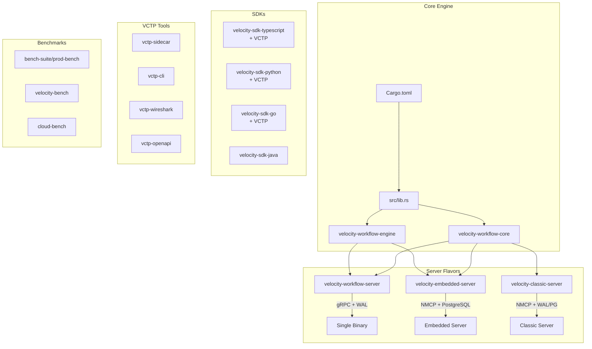
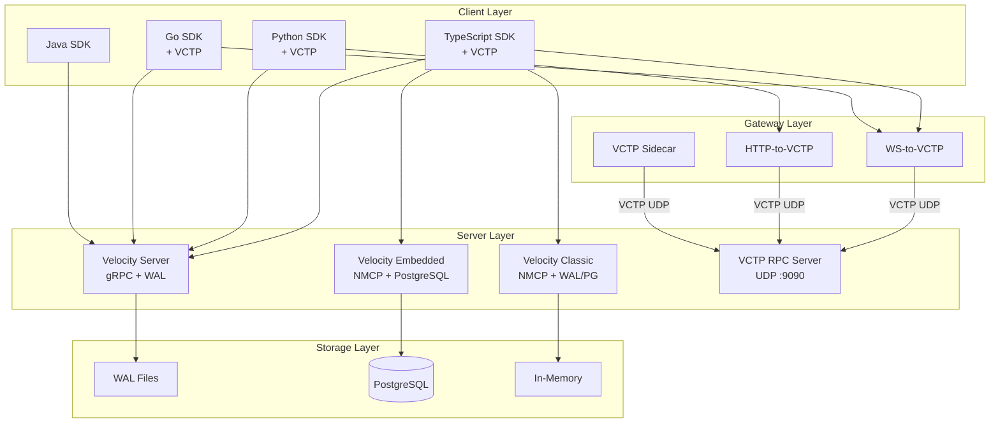

# Getting Started

<cite>
**Referenced Files in This Document**
- [README.md](file://README.md)
- [Cargo.toml](file://Cargo.toml)
- [docker-compose.yml](file://docker-compose.yml)
- [velocity-workflow-server/src/main.rs](file://velocity-workflow-server/src/main.rs)
- [velocity-classic-server/src/main.rs](file://velocity-classic-server/src/main.rs)
- [velocity-embedded-server/src/main.rs](file://velocity-embedded-server/src/main.rs)
- [velocity-workflow-engine/src/vctp_rpc.rs](file://velocity-workflow-engine/src/vctp_rpc.rs)
- [tools/vctp-sidecar/src/main.rs](file://tools/vctp-sidecar/src/main.rs)
- [deploy/helm/velocity/values.yaml](file://deploy/helm/velocity/values.yaml)
</cite>

## Table of Contents
1. [Introduction](#introduction)
2. [Project Structure](#project-structure)
3. [Core Components](#core-components)
4. [Architecture Overview](#architecture-overview)
5. [Installation and Setup](#installation-and-setup)
6. [Running the Engines](#running-the-engines)
7. [Benchmarking](#benchmarking)
8. [Troubleshooting](#troubleshooting)

## Introduction

V.E.L.O.C.I.T.Y. (Versatile Engine for Low-latency Orchestration, Coordination, and Intelligent Transaction Yield) is a high-performance workflow engine ecosystem designed as a modern alternative to Temporal, DBOS, and Restate. It provides durable execution with multiple deployment flavors to suit different use cases.

The project offers three distinct flavors:
- **Velocity Server** — Single binary Rust server with gRPC and WAL persistence
- **Velocity Embedded** — Rust server with PostgreSQL persistence for embedded deployments
- **Velocity Classic** — TypeScript SDK with Temporal-compatible API

## Project Structure

```
Velocity-workflow/
├── src/                          # Core Rust library
├── velocity-workflow-core/       # Core workflow abstractions & FFI (Slab Engine, Bitmask256)
├── velocity-workflow-engine/     # Engine (WAL, PG adapter, advisory locking, VCTP transport + RPC)
├── velocity-workflow-server/     # gRPC server with WAL (original flavor)
├── velocity-workflow-daemon/     # Background daemon
├── velocity-nmcp-protocol/       # NMCP binary protocol (shmem + WebSocket)
├── velocity-server-bootstrap/    # Shared server init, auth, rate-limit, audit, tracing
├── velocity-classic/             # Classic engine library (NMCP router)
├── velocity-classic-server/      # Classic server binary (NMCP + VCTP gateways)
├── velocity-classic-ts/          # TypeScript SDK (legacy client)
├── velocity-embedded/            # Embedded engine library (NMCP + PG)
├── velocity-embedded-server/     # Embedded server binary (NMCP + PostgreSQL)
├── velocity-sdk-typescript/      # TypeScript SDK (+ VCTP transport)
├── velocity-sdk-python/          # Python SDK (+ VCTP transport)
├── velocity-sdk-go/              # Go SDK (+ VCTP client)
├── velocity-sdk-java/            # Java SDK
├── velocity-runtime-typescript/  # TypeScript runtime
├── velocity-runtime-python/      # Python runtime
├── velocity-bench/               # HTTP benchmark tool
├── velocity-dev-server/          # Development server
├── velocity-test-framework/      # Integration test framework
├── velocity-migration-toolkit/   # Migration toolkit
├── tools/                        # VCTP developer tools
│   ├── vctp-sidecar/             # Sidecar proxy (ECDH + XOR cipher)
│   ├── vctp-cli/                 # Python CLI for VCTP operations
│   ├── vctp-wireshark/           # Wireshark Lua dissector
│   └── vctp-openapi/             # OpenAPI 3.0 spec generator
├── bench-suite/                  # Comprehensive benchmark suite
│   ├── prod-bench/               # Production benchmark tool
│   └── velocity-bench-server/    # gRPC benchmark service
├── benchmarks/                   # C# lifecycle benchmarks (.NET)
├── cloud-bench/                  # Cloud benchmark scripts
├── deploy/                       # Deployment configurations (incl. Helm charts)
├── migrations/                   # Database migrations
├── proto/                        # Protocol buffer + VCTP protocol definitions
├── sdk/                          # SDK implementations
├── tests/                        # Integration tests
├── docs/                         # Documentation (ops-runbooks, security-audit, otlp-tracing)
└── V.A.L.I.D/                    # Validation framework
```



**Diagram sources**
- [Cargo.toml](file://Cargo.toml)
- [velocity-workflow-server/Cargo.toml](file://velocity-workflow-server/Cargo.toml)
- [velocity-embedded/Cargo.toml](file://velocity-embedded/Cargo.toml)
- [velocity-classic-ts/package.json](file://velocity-classic-ts/package.json)

## Core Components

### Velocity Server (Single Binary)
The production gRPC server with Write-Ahead Log (WAL) persistence with background group-commit. This is the fastest flavor for pure throughput.

**Key files:**
- `velocity-workflow-server/src/main.rs` — Server entry point
- Uses WAL with group-commit for durable execution
- gRPC API on port 7234 (mapped to 17234 in Docker)

### Velocity Embedded
NMCP-based server with PostgreSQL persistence and per-step journal for embedded deployments requiring ACID transactions.

**Key files:**
- `velocity-embedded-server/src/main.rs` — Embedded server entry point
- NMCP shmem + WebSocket transport
- PostgreSQL persistence with per-step journal
- WebSocket API on port 8084

### Velocity Classic
Rust server with NMCP transport. Replaced the original TypeScript engine. Supports Temporal-compatible API patterns.

**Key files:**
- `velocity-classic-server/src/main.rs` — Classic server entry point
- NMCP shmem + WebSocket transport
- WAL + optional PostgreSQL persistence
- WebSocket API on port 8083

### VCTP RPC Server

High-performance UDP-based RPC server for VCTP (Velocity Transfer Protocol) workflow operations.

**Key files:**
- `velocity-workflow-core/src/vctp.rs` — HMAC-SHA256 authenticated encryption, replay protection, XOR cipher (623 lines)
- `velocity-workflow-engine/src/vctp_transport.rs` — UDP wire format (28-byte header + CRC32, 481 lines)
- `velocity-workflow-engine/src/vctp_rpc.rs` — Full request pipeline (circuit breaker, auth, drain, heartbeat, chaos tests, stress benchmarks, 2,767 lines)
- UDP port 9090 (default)
- 9,052 ops/s full-stack dispatch throughput
- 2,541 engine tests + 61 VCTP-specific tests

### VCTP Gateways

Protocol bridge gateways for connecting standard clients to VCTP:
- `velocity-classic-server/src/ws_vctp_gateway.rs` — WebSocket-to-VCTP gateway with TLS (WSS) and rate limiting (692 lines)
- `velocity-classic-server/src/http_vctp_ingress.rs` — HTTP-to-VCTP with Swagger UI at `/docs`, TLS (HTTPS) and rate limiting (871 lines)
- `tools/vctp-sidecar/src/main.rs` — Sidecar proxy with ECDH + XOR cipher (474 lines)

### VCTP Developer Tools

| Tool | Path | Description |
|------|------|-------------|
| vctp-cli | `tools/vctp-cli/` | Python CLI for VCTP operations (health, start, signal, query, cancel) |
| Wireshark dissector | `tools/vctp-wireshark/` | Lua-based packet inspection |
| OpenAPI generator | `tools/vctp-openapi/` | Generates OpenAPI 3.0.3 spec from VCTP protocol |
| Protocol schema | `proto/vctp_service.json` | Machine-readable VCTP protocol definition |

### SDKs
Multi-language SDKs for building workflows — all include VCTP transport support:
- TypeScript SDK with full type safety + VCTP UDP transport (358 lines)
- Python SDK with async support + VCTP transport (316 lines)
- Go SDK for high-performance services + VCTP client (451 lines)
- Java SDK for JVM ecosystems

## Architecture Overview



**Diagram sources**
- [velocity-workflow-server/src/main.rs](file://velocity-workflow-server/src/main.rs)
- [velocity-embedded-server/src/main.rs](file://velocity-embedded-server/src/main.rs)
- [velocity-classic-server/src/main.rs](file://velocity-classic-server/src/main.rs)

## Installation and Setup

### Prerequisites
- Rust toolchain (stable)
- Node.js 18+ (for TypeScript components)
- Docker and Docker Compose
- PostgreSQL 16+ (for Embedded flavor)

### Building from Source

1. **Clone the repository**
   ```bash
   git clone https://github.com/UnitBuilds-CC/V.E.L.O.C.I.T.Y.-WorkFlow.git
   cd V.E.L.O.C.I.T.Y.-WorkFlow
   ```

2. **Build the Rust workspace**
   ```bash
   cargo build --release
   ```

3. **Build TypeScript components**
   ```bash
   cd velocity-classic-ts
   npm install
   npm run build
   ```

## Running the Engines

### Using Docker Compose (Recommended)

```bash
cd bench-suite/prod-bench
docker compose up -d velocity velocity-embedded velocity-classic
```

This starts all three flavors:
- Velocity Server: `localhost:17234`
- Velocity Embedded: `localhost:18082`
- Velocity Classic: `localhost:18083`
- VCTP UDP (when enabled): `localhost:9090`
- HTTPS ingress (when TLS enabled): `localhost:8443`
- WSS gateway (when TLS enabled): `localhost:8444`

### Running Individual Flavors

**Velocity Server (Single Binary):**
```bash
cargo run --release --bin velocity-server
```

**Velocity Embedded:**
```bash
# Start PostgreSQL first
docker run -d --name velocity-pg -e POSTGRES_PASSWORD=velocity -p 5432:5432 postgres:16-alpine

# Run embedded server (NMCP shmem + WebSocket)
cargo run --release --bin velocity-embedded-server -- --postgres "host=localhost port=5432 dbname=velocity user=velocity password=velocity"
```

**Velocity Classic:**
```bash
# Run classic server (NMCP shmem + WebSocket)
cargo run --release --bin velocity-classic-server
```

## Benchmarking

### Quick Benchmark
```bash
cd bench-suite/prod-bench
cargo build --release
./target/release/prod-bench --engines all --profile quick
```

### Full Production Benchmark
```bash
./target/release/prod-bench --engines all --profile standard
```

### Individual Engine Benchmark
```bash
# Velocity Server only
./target/release/prod-bench --engines velocity --velocity-url http://localhost:17234

# Velocity Embedded only
./target/release/prod-bench --engines velocity-embedded --velocity-embedded-url http://localhost:18082

# Velocity Classic only
./target/release/prod-bench --engines velocity-classic --velocity-classic-url http://localhost:18083
```

### VCTP Benchmarks

VCTP-specific performance benchmarks are built into the engine test suite:

```bash
# Run VCTP benchmarks (included in engine tests)
cargo test -p velocity-workflow-engine --release -- vctp_bench

# Key metrics:
# - Full-stack dispatch: 9,052 ops/s (UDP + WAL + DB), CI threshold ≥5,000 ops/s
# - Full-stack start_workflow: 7,375 ops/s, CI threshold ≥5,000 ops/s
# - Concurrent stress (100 clients): ≥2,000 ops/s, >90% delivery
# - Cross-network (4 zones): ≥1,000 ops/s, >85% delivery
# - HMAC-SHA256 throughput: ≥100,000 ops/s
# - Replay window checks: ≥10,000,000 ops/s
# - E2E round-trip p99: <5ms
```

### VCTP CLI Tool

```bash
# Health check
python tools/vctp-cli/vctp_cli.py health --server 127.0.0.1:9090

# Start a workflow
python tools/vctp-cli/vctp_cli.py start-workflow --server 127.0.0.1:9090 --type my-workflow --steps 5

# Query workflow state
python tools/vctp-cli/vctp_cli.py query --server 127.0.0.1:9090 --workflow-id wf-123
```

### Benchmark Results Summary

| Engine | Throughput | p50 Latency | Memory | Persistence |
|--------|-----------|-------------|--------|-------------|
| Velocity Embedded | 61.25 ops/s | 14.65ms | 1.25 MiB | PostgreSQL |
| Velocity Classic | 61.54 ops/s | 14.51ms | 9.23 MiB | In-Memory |
| Velocity Server | 43.6 ops/s | 180ms | 98.76 MiB | WAL |
| DBOS | 59.59 ops/s | 15.52ms | 63.23 MiB | PostgreSQL |
| Restate | 41.14 ops/s | 23.02ms | 200.36 MiB | RocksDB |
| Temporal | 35.9 ops/s | 176ms | 563 MiB | PostgreSQL |

## Troubleshooting

### Common Issues

**Port already in use**
- Check if ports 17234, 18082, 18083, 9090 (VCTP UDP), 8443 (HTTPS), 8444 (WSS) are available
- Use `netstat -ano | findstr :17234` on Windows
- For VCTP: `netstat -ano | findstr :9090` (look for UDP)

**Docker container exits immediately**
- Check logs: `docker logs pb-velocity`
- Ensure all dependencies are running (PostgreSQL for embedded)

**Benchmark connection refused**
- Verify containers are healthy: `docker ps`
- Wait for health checks to pass before running benchmarks

**TypeScript build errors**
- Ensure Node.js 18+ is installed
- Run `npm install` in TypeScript directories
- Clear node_modules and reinstall if needed

**Rust compilation errors**
- Update toolchain: `rustup update stable`
- Clean build: `cargo clean && cargo build --release`

### Getting Help
- Check the [docs/](file://docs) directory for detailed documentation
- Review benchmark results in [bench-suite/](file://bench-suite)
- Examine deployment configs in [deploy/](file://deploy)

**Section sources**
- [README.md](file://README.md)
- [docker-compose.yml](file://docker-compose.yml)
- [Cargo.toml](file://Cargo.toml)
- [bench-suite/prod-bench/README.md](file://bench-suite/prod-bench/README.md)
- [velocity-workflow-engine/src/vctp_rpc.rs](file://velocity-workflow-engine/src/vctp_rpc.rs)
- [tools/vctp-sidecar/src/main.rs](file://tools/vctp-sidecar/src/main.rs)
- [deploy/helm/velocity/values.yaml](file://deploy/helm/velocity/values.yaml)
