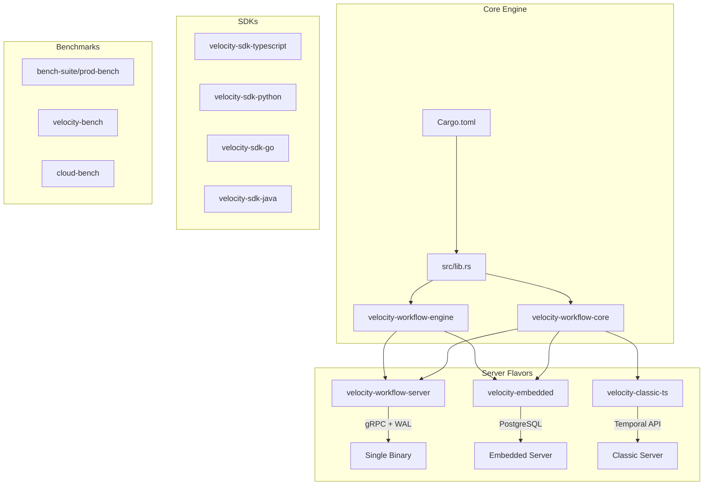
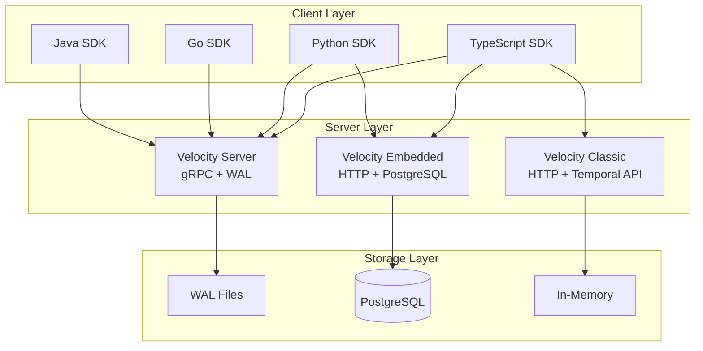

# Getting Started

<cite>
**Referenced Files in This Document**
- [README.md](file://README.md)
- [Cargo.toml](file://Cargo.toml)
- [docker-compose.yml](file://docker-compose.yml)
- [src/main.rs](file://src/main.rs)
- [velocity-workflow-server/src/main.rs](file://velocity-workflow-server/src/main.rs)
- [velocity-embedded/src/main.rs](file://velocity-embedded/src/main.rs)
- [velocity-classic-ts/src/index.ts](file://velocity-classic-ts/src/index.ts)
</cite>

## Table of Contents
1. [Introduction](#introduction)
2. [Project Structure](#project-structure)
3. [Core Components](#core-components)
4. [Architecture Overview](#architecture-overview)
5. [Installation and Setup](#installation-and-setup)
6. [Running the Engines](#running-the-engines)
7. [Benchmarking](#benchmarking)
8. [Troubleshooting](#troubleshooting)

## Introduction

V.E.L.O.C.I.T.Y. (Versatile Engine for Low-latency Orchestration, Coordination, and Intelligent Transaction Yield) is a high-performance workflow engine ecosystem designed as a modern alternative to Temporal, DBOS, and Restate. It provides durable execution with multiple deployment flavors to suit different use cases.

The project offers three distinct flavors:
- **Velocity Server** — Single binary Rust server with gRPC and WAL persistence
- **Velocity Embedded** — Rust server with PostgreSQL persistence for embedded deployments
- **Velocity Classic** — TypeScript SDK with Temporal-compatible API

## Project Structure

```
Velocity-workflow/
├── src/                          # Core Rust library
├── velocity-workflow-server/     # Single binary gRPC server
├── velocity-embedded/            # Embedded PostgreSQL-backed server
├── velocity-classic-ts/          # TypeScript Temporal-compatible SDK
├── velocity-sdk-typescript/      # TypeScript SDK
├── velocity-sdk-python/          # Python SDK
├── velocity-sdk-go/              # Go SDK
├── velocity-sdk-java/            # Java SDK
├── velocity-runtime-typescript/  # TypeScript runtime
├── velocity-runtime-python/      # Python runtime
├── velocity-workflow-core/       # Core workflow abstractions
├── velocity-workflow-engine/     # Engine implementation
├── velocity-workflow-daemon/     # Background daemon
├── velocity-bench/               # Benchmark suite
├── velocity-classic/             # Classic Rust implementation
├── bench-suite/                  # Comprehensive benchmark suite
│   └── prod-bench/               # Production benchmark tool
├── cloud-bench/                  # Cloud benchmark scripts
├── deploy/                       # Deployment configurations
├── migrations/                   # Database migrations
├── proto/                        # Protocol buffer definitions
├── sdk/                          # SDK implementations
├── tests/                        # Integration tests
└── docs/                         # Documentation
```



**Diagram sources**
- [Cargo.toml](file://Cargo.toml)
- [velocity-workflow-server/Cargo.toml](file://velocity-workflow-server/Cargo.toml)
- [velocity-embedded/Cargo.toml](file://velocity-embedded/Cargo.toml)
- [velocity-classic-ts/package.json](file://velocity-classic-ts/package.json)

## Core Components

### Velocity Server (Single Binary)
The production gRPC server with Write-Ahead Log (WAL) persistence. This is the fastest flavor for pure throughput.

**Key files:**
- `velocity-workflow-server/src/main.rs` — Server entry point
- Uses WAL for durable execution
- gRPC API on port 7234 (mapped to 17234 in Docker)

### Velocity Embedded
PostgreSQL-backed server for embedded deployments where you need database durability without external dependencies.

**Key files:**
- `velocity-embedded/src/main.rs` — Embedded server entry point
- PostgreSQL persistence layer
- HTTP API on port 8082 (mapped to 18082 in Docker)

### Velocity Classic
TypeScript SDK providing Temporal-compatible API for easy migration from Temporal workflows.

**Key files:**
- `velocity-classic-ts/src/index.ts` — Worker, Workflow, Activity classes
- `velocity-classic-ts/src/main.ts` — Server entry point
- HTTP API on port 8083 (mapped to 18083 in Docker)

### SDKs
Multi-language SDKs for building workflows:
- TypeScript SDK with full type safety
- Python SDK with async support
- Go SDK for high-performance services
- Java SDK for JVM ecosystems

## Architecture Overview



**Diagram sources**
- [velocity-workflow-server/src/main.rs](file://velocity-workflow-server/src/main.rs)
- [velocity-embedded/src/main.rs](file://velocity-embedded/src/main.rs)
- [velocity-classic-ts/src/main.ts](file://velocity-classic-ts/src/main.ts)

## Installation and Setup

### Prerequisites
- Rust toolchain (stable)
- Node.js 18+ (for TypeScript components)
- Docker and Docker Compose
- PostgreSQL 16+ (for Embedded flavor)

### Building from Source

1. **Clone the repository**
   ```bash
   git clone https://github.com/UnitBuilds-CC/V.E.L.O.C.I.T.Y.-WorkFlow.git
   cd V.E.L.O.C.I.T.Y.-WorkFlow
   ```

2. **Build the Rust workspace**
   ```bash
   cargo build --release
   ```

3. **Build TypeScript components**
   ```bash
   cd velocity-classic-ts
   npm install
   npm run build
   ```

## Running the Engines

### Using Docker Compose (Recommended)

```bash
cd bench-suite/prod-bench
docker compose up -d velocity velocity-embedded velocity-classic
```

This starts all three flavors:
- Velocity Server: `localhost:17234`
- Velocity Embedded: `localhost:18082`
- Velocity Classic: `localhost:18083`

### Running Individual Flavors

**Velocity Server (Single Binary):**
```bash
cargo run --release --bin velocity-server
```

**Velocity Embedded:**
```bash
# Start PostgreSQL first
docker run -d --name velocity-pg -e POSTGRES_PASSWORD=velocity -p 5432:5432 postgres:16-alpine

# Run embedded server
cargo run --release --bin velocity-embedded-server
```

**Velocity Classic:**
```bash
cd velocity-classic-ts
npm run start
```

## Benchmarking

### Quick Benchmark
```bash
cd bench-suite/prod-bench
cargo build --release
./target/release/prod-bench --engines all --profile quick
```

### Full Production Benchmark
```bash
./target/release/prod-bench --engines all --profile standard
```

### Individual Engine Benchmark
```bash
# Velocity Server only
./target/release/prod-bench --engines velocity --velocity-url http://localhost:17234

# Velocity Embedded only
./target/release/prod-bench --engines velocity-embedded --velocity-embedded-url http://localhost:18082

# Velocity Classic only
./target/release/prod-bench --engines velocity-classic --velocity-classic-url http://localhost:18083
```

### Benchmark Results Summary

| Engine | Throughput | p50 Latency | Memory | Persistence |
|--------|-----------|-------------|--------|-------------|
| Velocity Embedded | 61.25 ops/s | 14.65ms | 1.25 MiB | PostgreSQL |
| Velocity Classic | 61.54 ops/s | 14.51ms | 9.23 MiB | In-Memory |
| Velocity Server | 43.6 ops/s | 180ms | 98.76 MiB | WAL |
| DBOS | 59.59 ops/s | 15.52ms | 63.23 MiB | PostgreSQL |
| Restate | 41.14 ops/s | 23.02ms | 200.36 MiB | RocksDB |
| Temporal | 35.9 ops/s | 176ms | 563 MiB | PostgreSQL |

## Troubleshooting

### Common Issues

**Port already in use**
- Check if ports 17234, 18082, 18083 are available
- Use `netstat -ano | findstr :17234` on Windows

**Docker container exits immediately**
- Check logs: `docker logs pb-velocity`
- Ensure all dependencies are running (PostgreSQL for embedded)

**Benchmark connection refused**
- Verify containers are healthy: `docker ps`
- Wait for health checks to pass before running benchmarks

**TypeScript build errors**
- Ensure Node.js 18+ is installed
- Run `npm install` in TypeScript directories
- Clear node_modules and reinstall if needed

**Rust compilation errors**
- Update toolchain: `rustup update stable`
- Clean build: `cargo clean && cargo build --release`

### Getting Help
- Check the [docs/](file://docs) directory for detailed documentation
- Review benchmark results in [bench-suite/](file://bench-suite)
- Examine deployment configs in [deploy/](file://deploy)

**Section sources**
- [README.md](file://README.md)
- [docker-compose.yml](file://docker-compose.yml)
- [bench-suite/prod-bench/README.md](file://bench-suite/prod-bench/README.md)
