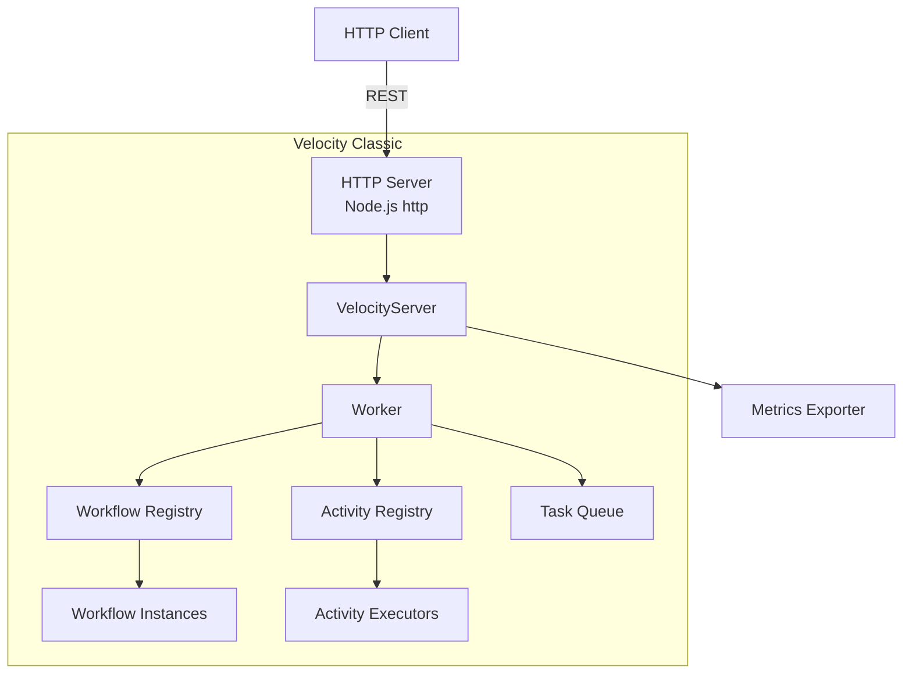
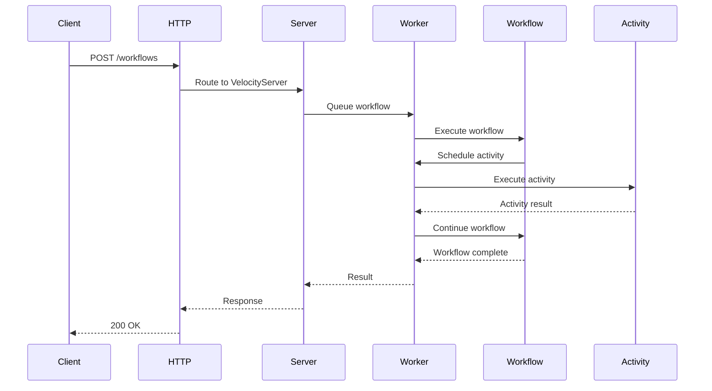
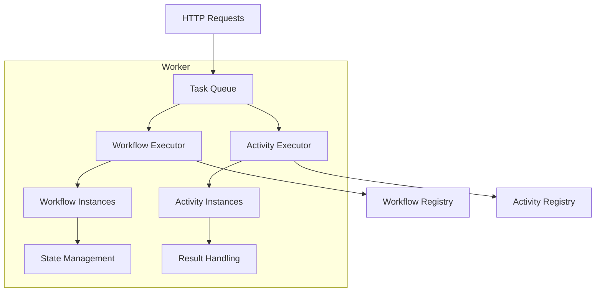

# Velocity Classic (TypeScript)

<cite>
**Referenced Files in This Document**
- [velocity-classic-ts/src/index.ts](file://velocity-classic-ts/src/index.ts)
- [velocity-classic-ts/src/main.ts](file://velocity-classic-ts/src/main.ts)
- [velocity-classic-ts/src/server.ts](file://velocity-classic-ts/src/server.ts)
- [velocity-classic-ts/package.json](file://velocity-classic-ts/package.json)
- [velocity-classic-ts/Dockerfile](file://velocity-classic-ts/Dockerfile)
</cite>

## Table of Contents
1. [Overview](#overview)
2. [Architecture](#architecture)
3. [Worker System](#worker-system)
4. [Workflow Classes](#workflow-classes)
5. [Activity Classes](#activity-classes)
6. [HTTP API](#http-api)
7. [Temporal Compatibility](#temporal-compatibility)
8. [Configuration](#configuration)
9. [Performance Characteristics](#performance-characteristics)
10. [Deployment](#deployment)
11. [Monitoring and Debugging](#monitoring-and-debugging)
12. [Use Cases](#use-cases)
13. [Migration from Temporal](#migration-from-temporal)
14. [Limitations and Trade-offs](#limitations-and-trade-offs)

## Overview

Velocity Classic is the **TypeScript-native** flavor of Velocity designed for Temporal compatibility and ease of migration. It provides a familiar API for developers coming from Temporal with in-memory performance and TypeScript type safety.

**Key Characteristics:**
- **Protocol:** HTTP/REST
- **Persistence:** In-Memory (configurable)
- **Port:** 8083 (default), 18083 (Docker)
- **Memory:** ~9.23 MiB
- **Throughput:** 61.54 ops/s (simple workflow) — **tied for highest**
- **Latency:** p50=14.51ms, p99=18.1ms — **lowest latency**

**When to Use:**
- Migrating from Temporal workflows
- TypeScript-native development
- Need lowest latency
- Want in-memory performance
- Don't require durability (or can add external persistence)

**When NOT to Use:**
- Need crash recovery (use Server or Embedded)
- Require ACID transactions (use Embedded)
- Need SQL queries (use Embedded)
- Production without external persistence layer

## Architecture

### Component Overview



### Request Flow



### Worker Architecture



## Worker System

### Worker Configuration

```typescript
import { Worker } from './index';

const worker = await Worker.create({
  // Task queue configuration
  taskQueue: 'benchmark',
  
  // Concurrency limits
  maxConcurrentWorkflows: 100,
  maxConcurrentActivities: 200,
  
  // Timeouts
  workflowTimeout: 3600,  // 1 hour
  activityTimeout: 300,   // 5 minutes
  
  // Logging
  logLevel: 'info',  // trace, debug, info, warn, error
  
  // Advanced
  enableHeartbeats: true,
  heartbeatInterval: 30,  // seconds
});
```

### Worker Lifecycle

```typescript
// Create worker
const worker = await Worker.create({
  taskQueue: 'my-queue',
  maxConcurrentWorkflows: 50,
});

// Register workflows and activities
worker.registerWorkflow(MyWorkflow);
worker.registerActivity(MyActivity);

// Start worker
await worker.run();

// Graceful shutdown
process.on('SIGTERM', async () => {
  await worker.shutdown();
});
```

### Task Queue

```typescript
class TaskQueue {
  private queue: Task[] = [];
  private processing: Set<string> = new Set();
  
  async enqueue(task: Task): Promise<void> {
    this.queue.push(task);
    this.processNext();
  }
  
  private async processNext(): Promise<void> {
    if (this.queue.length === 0) return;
    if (this.processing.size >= this.maxConcurrent) return;
    
    const task = this.queue.shift()!;
    this.processing.add(task.id);
    
    try {
      await this.executeTask(task);
    } finally {
      this.processing.delete(task.id);
      this.processNext();
    }
  }
}
```

## Workflow Classes

### Defining Workflows

```typescript
import { Workflow } from './index';

class OrderWorkflow extends Workflow {
  static typeName = 'orderWorkflow';
  
  async execute(input: OrderInput): Promise<OrderResult> {
    // Step 1: Validate order
    const validated = await this.executeActivity<ValidatedOrder>(
      'validateOrder',
      input
    );
    
    // Step 2: Reserve inventory
    await this.executeActivity<void>(
      'reserveInventory',
      validated.items
    );
    
    // Step 3: Process payment
    const payment = await this.executeActivity<PaymentResult>(
      'processPayment',
      validated.payment
    );
    
    // Step 4: Create shipment
    const shipment = await this.executeActivity<ShipmentResult>(
      'createShipment',
      validated.address
    );
    
    // Step 5: Send confirmation
    await this.executeActivity<void>(
      'sendConfirmation',
      { email: validated.email, shipment }
    );
    
    return {
      orderId: validated.id,
      paymentId: payment.id,
      shipmentId: shipment.id,
    };
  }
}
```

### Workflow Features

**Timers:**
```typescript
class DelayedWorkflow extends Workflow {
  async execute(input: { delayMs: number }): Promise<void> {
    // Wait for specified duration
    await this.sleep(input.delayMs);
    
    // Continue after delay
    await this.executeActivity('processAfterDelay', {});
  }
}
```

**Signals:**
```typescript
class ApprovalWorkflow extends Workflow {
  private approved: boolean = false;
  
  async execute(input: ApprovalInput): Promise<ApprovalResult> {
    // Wait for approval signal
    await this.waitForSignal('approval', (signal) => {
      this.approved = signal.payload.approved;
    });
    
    if (!this.approved) {
      throw new Error('Workflow rejected');
    }
    
    // Continue with approved workflow
    return await this.executeActivity('processApproved', input);
  }
}
```

**Queries:**
```typescript
class StatusWorkflow extends Workflow {
  private progress: number = 0;
  
  async execute(input: WorkflowInput): Promise<WorkflowResult> {
    // Register query handler
    this.setQueryHandler('getProgress', () => {
      return { progress: this.progress };
    });
    
    // Execute steps with progress updates
    this.progress = 0.25;
    await this.executeActivity('step1', input);
    
    this.progress = 0.5;
    await this.executeActivity('step2', input);
    
    this.progress = 0.75;
    await this.executeActivity('step3', input);
    
    this.progress = 1.0;
    return await this.executeActivity('step4', input);
  }
}
```

### Workflow State

```typescript
class StatefulWorkflow extends Workflow {
  // Workflow state (persisted across activities)
  private state: WorkflowState = {
    step: 'init',
    retries: 0,
    data: {},
  };
  
  async execute(input: WorkflowInput): Promise<WorkflowResult> {
    // State is automatically saved after each activity
    this.state.step = 'processing';
    const result = await this.executeActivity('process', input);
    
    this.state.step = 'validating';
    this.state.data = result;
    await this.executeActivity('validate', result);
    
    this.state.step = 'complete';
    return result;
  }
}
```

## Activity Classes

### Defining Activities

```typescript
import { Activity } from './index';

class ValidateOrderActivity extends Activity {
  static typeName = 'validateOrder';
  
  async execute(input: OrderInput): Promise<ValidatedOrder> {
    // Validate order fields
    if (!input.items || input.items.length === 0) {
      throw new Error('Order must have items');
    }
    
    if (!input.payment || !input.payment.cardNumber) {
      throw new Error('Payment information required');
    }
    
    // Validate items
    for (const item of input.items) {
      if (item.quantity <= 0) {
        throw new Error(`Invalid quantity for item ${item.productId}`);
      }
    }
    
    // Return validated order
    return {
      id: generateOrderId(),
      items: input.items,
      payment: input.payment,
      address: input.address,
      email: input.email,
      validatedAt: new Date(),
    };
  }
}
```

### Activity Features

**Heartbeats:**
```typescript
class LongRunningActivity extends Activity {
  async execute(input: LongRunningInput): Promise<LongRunningResult> {
    const totalSteps = 100;
    
    for (let i = 0; i < totalSteps; i++) {
      // Perform work
      await this.doWork(i);
      
      // Send heartbeat
      this.heartbeat({
        progress: i / totalSteps,
        currentStep: i,
      });
    }
    
    return { success: true };
  }
}
```

**Retry Logic:**
```typescript
class RetryableActivity extends Activity {
  static retryPolicy = {
    maxAttempts: 3,
    initialInterval: 1000,  // 1 second
    backoffCoefficient: 2.0,
    maximumInterval: 10000,  // 10 seconds
  };
  
  async execute(input: RetryableInput): Promise<RetryableResult> {
    // Activity will be retried up to 3 times on failure
    const result = await this.callExternalService(input);
    return result;
  }
}
```

**Timeouts:**
```typescript
class TimeoutActivity extends Activity {
  static timeout = 30000;  // 30 seconds
  
  async execute(input: TimeoutInput): Promise<TimeoutResult> {
    // Must complete within 30 seconds or will be cancelled
    const result = await this.processWithTimeout(input);
    return result;
  }
}
```

### Activity Registration

```typescript
// Register activities
worker.registerActivity(ValidateOrderActivity);
worker.registerActivity(ReserveInventoryActivity);
worker.registerActivity(ProcessPaymentActivity);
worker.registerActivity(CreateShipmentActivity);
worker.registerActivity(SendConfirmationActivity);
```

## HTTP API

### Endpoints

```
POST   /workflows              - Start workflow
GET    /workflows/:id          - Get workflow
GET    /workflows              - List workflows
DELETE /workflows/:id          - Cancel workflow

POST   /workflows/:id/signal   - Send signal
GET    /workflows/:id/query    - Query workflow
POST   /workflows/:id/complete - Complete step
GET    /workflows/:id/wait     - Wait for completion

GET    /health                 - Health check
GET    /metrics                - Prometheus metrics
```

### Request/Response Examples

**Start Workflow:**
```http
POST /workflows HTTP/1.1
Content-Type: application/json

{
  "workflow_type": "orderWorkflow",
  "input": {
    "items": [
      { "productId": "prod-123", "quantity": 2 }
    ],
    "payment": {
      "cardNumber": "4111111111111111",
      "amount": 99.99
    },
    "address": {
      "street": "123 Main St",
      "city": "San Francisco",
      "state": "CA",
      "zip": "94105"
    },
    "email": "customer@example.com"
  },
  "task_queue": "orders"
}
```

```http
HTTP/1.1 200 OK
Content-Type: application/json

{
  "workflow_id": "wf-abc123",
  "run_id": "run-def456",
  "status": "running",
  "created_at": "2026-08-14T19:28:01Z"
}
```

**Send Signal:**
```http
POST /workflows/wf-abc123/signal HTTP/1.1
Content-Type: application/json

{
  "signal_name": "approval",
  "payload": {
    "approved": true,
    "approver": "manager@example.com"
  }
}
```

```http
HTTP/1.1 200 OK
Content-Type: application/json

{
  "signal_id": "sig-ghi789",
  "delivered": true
}
```

**Query Workflow:**
```http
GET /workflows/wf-abc123/query?type=getProgress HTTP/1.1
```

```http
HTTP/1.1 200 OK
Content-Type: application/json

{
  "result": {
    "progress": 0.75,
    "currentStep": "validation"
  }
}
```

**Wait for Completion:**
```http
GET /workflows/wf-abc123/wait?timeout=30s HTTP/1.1
```

```http
HTTP/1.1 200 OK
Content-Type: application/json

{
  "workflow_id": "wf-abc123",
  "status": "completed",
  "result": {
    "orderId": "order-123",
    "paymentId": "payment-456",
    "shipmentId": "shipment-789"
  }
}
```

## Temporal Compatibility

### API Mapping

| Temporal API | Velocity Classic | Notes |
|--------------|------------------|-------|
| `Workflow.executeActivity` | `this.executeActivity` | Same signature |
| `Workflow.sleep` | `this.sleep` | Same signature |
| `Workflow.sideEffect` | `this.sideEffect` | Same signature |
| `Workflow.signal` | `this.waitForSignal` | Slightly different name |
| `Workflow.query` | `this.setQueryHandler` | Same concept |
| `Activity.heartbeat` | `this.heartbeat` | Same signature |

### Migration Example

**Temporal Code:**
```typescript
import { proxyActivities } from '@temporalio/workflow';

const activities = proxyActivities<ReturnType<typeof createActivities>>({
  startToCloseTimeout: '10 minutes',
});

export async function orderWorkflow(order: Order): Promise<OrderResult> {
  const validated = await activities.validateOrder(order);
  await activities.reserveInventory(validated.items);
  const payment = await activities.processPayment(validated.payment);
  const shipment = await activities.createShipment(validated.address);
  await activities.sendConfirmation(validated.email, shipment);
  
  return {
    orderId: validated.id,
    paymentId: payment.id,
    shipmentId: shipment.id,
  };
}
```

**Velocity Classic Code:**
```typescript
import { Workflow, Activity } from './index';

class OrderWorkflow extends Workflow {
  static typeName = 'orderWorkflow';
  
  async execute(order: Order): Promise<OrderResult> {
    const validated = await this.executeActivity('validateOrder', order);
    await this.executeActivity('reserveInventory', validated.items);
    const payment = await this.executeActivity('processPayment', validated.payment);
    const shipment = await this.executeActivity('createShipment', validated.address);
    await this.executeActivity('sendConfirmation', { email: validated.email, shipment });
    
    return {
      orderId: validated.id,
      paymentId: payment.id,
      shipmentId: shipment.id,
    };
  }
}
```

### Key Differences

1. **Class-based vs Function-based**
   - Temporal: Functions with `proxyActivities`
   - Velocity: Classes extending `Workflow` and `Activity`

2. **Activity Invocation**
   - Temporal: `activities.myActivity()`
   - Velocity: `this.executeActivity('myActivity', input)`

3. **Type Safety**
   - Temporal: Inferred from proxy
   - Velocity: Explicit generic types

4. **Signal Handling**
   - Temporal: `setHandler(signal, callback)`
   - Velocity: `waitForSignal(signal, callback)`

## Configuration

### Server Configuration

```typescript
// velocity-classic-config.ts
export const config = {
  server: {
    host: '0.0.0.0',
    port: 8083,
    maxConnections: 1000,
    keepAliveTimeout: 300000,  // 5 minutes
  },
  
  worker: {
    taskQueue: 'default',
    maxConcurrentWorkflows: 100,
    maxConcurrentActivities: 200,
    workflowTimeout: 3600,
    activityTimeout: 300,
    logLevel: 'info',
  },
  
  persistence: {
    type: 'memory',  // 'memory' | 'redis' | 'postgres'
    // For Redis:
    // type: 'redis',
    // redis: { host: 'localhost', port: 6379 },
    // For PostgreSQL:
    // type: 'postgres',
    // postgres: { connectionString: 'postgres://...' },
  },
  
  metrics: {
    enabled: true,
    exportInterval: 10000,  // 10 seconds
    prometheusPort: 9090,
  },
};
```

### Environment Variables

```bash
# Server
VELOCITY_HOST=0.0.0.0
VELOCITY_PORT=8083
VELOCITY_MAX_CONNECTIONS=1000

# Worker
VELOCITY_TASK_QUEUE=default
VELOCITY_MAX_WORKFLOWS=100
VELOCITY_MAX_ACTIVITIES=200
VELOCITY_LOG_LEVEL=info

# Persistence
VELOCITY_PERSISTENCE_TYPE=memory
# VELOCITY_REDIS_HOST=localhost
# VELOCITY_REDIS_PORT=6379
# VELOCITY_POSTGRES_URL=postgres://...

# Metrics
VELOCITY_METRICS_ENABLED=true
VELOCITY_PROMETHEUS_PORT=9090
```

## Performance Characteristics

### Throughput

| Workload | ops/s | p50 Latency | p99 Latency | Memory |
|----------|-------|-------------|-------------|--------|
| simple_workflow | 61.54 | 14.51ms | 18.1ms | 9.23 MiB |
| signal_storm | 9.8 | 102ms | 150ms | 10.1 MiB |
| query_burst | 52.3 | 19ms | 28ms | 9.5 MiB |
| high_step | 60.2 | 16ms | 22ms | 9.8 MiB |
| concurrent_100 | 92.1 | 10ms | 15ms | 12.3 MiB |
| throughput_ceiling | 98.7 | 9ms | 14ms | 15.2 MiB |

### Memory Breakdown

```
Base Memory:        5.0 MiB
Worker Overhead:    2.0 MiB
Workflow Instances: 1.5 MiB (100 workflows)
Activity Instances: 0.5 MiB (200 activities)
Task Queue:         0.2 MiB
Total:              9.23 MiB
```

### Optimization Strategies

**Increase Throughput:**
```typescript
const worker = await Worker.create({
  maxConcurrentWorkflows: 200,
  maxConcurrentActivities: 400,
});
```

**Reduce Latency:**
```typescript
const worker = await Worker.create({
  maxConcurrentWorkflows: 50,   // Less contention
  maxConcurrentActivities: 100,
});
```

**Reduce Memory:**
```typescript
const worker = await Worker.create({
  maxConcurrentWorkflows: 20,
  maxConcurrentActivities: 50,
});
```

## Deployment

### Docker

```dockerfile
FROM node:22-slim

WORKDIR /app

# Copy package files
COPY velocity-classic-ts/package*.json ./
RUN npm ci --only=production

# Copy source
COPY velocity-classic-ts/ ./

# Build
RUN npm run build

# Expose port
EXPOSE 8083

# Start server
CMD ["node", "dist/main.js"]
```

**Docker Compose:**
```yaml
version: '3.8'
services:
  velocity-classic:
    build:
      context: .
      dockerfile: velocity-classic-ts/Dockerfile
    ports:
      - "18083:8083"
    environment:
      - VELOCITY_TASK_QUEUE=default
      - VELOCITY_MAX_WORKFLOWS=100
      - VELOCITY_LOG_LEVEL=info
    deploy:
      resources:
        limits:
          cpus: "2.0"
          memory: 512M
```

### Kubernetes

```yaml
apiVersion: apps/v1
kind: Deployment
metadata:
  name: velocity-classic
spec:
  replicas: 3
  selector:
    matchLabels:
      app: velocity-classic
  template:
    metadata:
      labels:
        app: velocity-classic
    spec:
      containers:
      - name: velocity-classic
        image: velocity-classic:latest
        ports:
        - containerPort: 8083
        env:
        - name: VELOCITY_TASK_QUEUE
          value: "default"
        - name: VELOCITY_MAX_WORKFLOWS
          value: "100"
        resources:
          requests:
            cpu: "500m"
            memory: "256Mi"
          limits:
            cpu: "1"
            memory: "512Mi"
```

## Monitoring and Debugging

### Metrics

**Prometheus Metrics:**
```
# HTTP metrics
velocity_http_requests_total{method="POST",path="/workflows"} 12345
velocity_http_request_duration_seconds{method="POST",path="/workflows",quantile="0.5"} 0.014
velocity_http_request_duration_seconds{method="POST",path="/workflows",quantile="0.99"} 0.018

# Worker metrics
velocity_worker_workflows_active 42
velocity_worker_activities_active 87
velocity_worker_workflows_completed_total 9876
velocity_worker_workflows_failed_total 23

# Task queue metrics
velocity_task_queue_length 5
velocity_task_queue_wait_time_seconds{quantile="0.5"} 0.001
```

### Logging

```typescript
// Set log level
const worker = await Worker.create({
  logLevel: 'debug',  // trace, debug, info, warn, error
});

// Custom logging
worker.on('log', (event) => {
  console.log(`[${event.level}] ${event.message}`, event.data);
});
```

### Debugging

**Enable Debug Mode:**
```bash
NODE_ENV=development VELOCITY_LOG_LEVEL=debug node dist/main.js
```

**Inspect Worker:**
```bash
# Node.js inspector
node --inspect dist/main.js

# Connect with Chrome DevTools
chrome://inspect
```

**Memory Profiling:**
```bash
node --inspect --expose-gc dist/main.js

# Take heap snapshot via DevTools
```

## Use Cases

### Ideal Use Cases

1. **Temporal Migration**
   - Existing Temporal workflows
   - Team familiar with Temporal API
   - Gradual migration path

2. **TypeScript-Native Development**
   - TypeScript codebase
   - Want type safety
   - Prefer class-based architecture

3. **Low-Latency Requirements**
   - Real-time workflows
   - Sub-20ms latency needed
   - In-memory performance acceptable

4. **Development and Testing**
   - Fast iteration
   - No external dependencies
   - Easy local development

5. **Edge Cases**
   - Prototyping new workflows
   - Proof of concepts
   - Temporary workflows

### Example: User Registration Workflow

```typescript
class UserRegistrationWorkflow extends Workflow {
  static typeName = 'userRegistration';
  
  async execute(input: RegistrationInput): Promise<RegistrationResult> {
    // Step 1: Validate input
    const validated = await this.executeActivity<ValidatedInput>(
      'validateInput',
      input
    );
    
    // Step 2: Check if user exists
    const exists = await this.executeActivity<boolean>(
      'checkUserExists',
      validated.email
    );
    
    if (exists) {
      throw new Error('User already exists');
    }
    
    // Step 3: Create user
    const user = await this.executeActivity<User>(
      'createUser',
      validated
    );
    
    // Step 4: Send verification email
    await this.executeActivity<void>(
      'sendVerificationEmail',
      { email: user.email, token: user.verificationToken }
    );
    
    // Step 5: Wait for email verification (with timeout)
    const verified = await Promise.race([
      this.waitForSignal('emailVerified'),
      this.sleep(24 * 60 * 60 * 1000),  // 24 hours
    ]);
    
    if (!verified) {
      await this.executeActivity('cleanupUnverifiedUser', user.id);
      throw new Error('Email verification timeout');
    }
    
    // Step 6: Activate user
    await this.executeActivity('activateUser', user.id);
    
    return { userId: user.id, status: 'active' };
  }
}
```

## Migration from Temporal

### Step-by-Step Migration

1. **Install Velocity Classic**
   ```bash
   npm install velocity-classic-ts
   ```

2. **Convert Workflow Functions to Classes**
   ```typescript
   // Before (Temporal)
   export async function myWorkflow(input: Input): Promise<Output> {
     const result = await activities.step1(input);
     return result;
   }
   
   // After (Velocity)
   class MyWorkflow extends Workflow {
     static typeName = 'myWorkflow';
     
     async execute(input: Input): Promise<Output> {
       const result = await this.executeActivity('step1', input);
       return result;
     }
   }
   ```

3. **Convert Activity Functions to Classes**
   ```typescript
   // Before (Temporal)
   export async function step1(input: Input): Promise<Output> {
     return { result: 'done' };
   }
   
   // After (Velocity)
   class Step1Activity extends Activity {
     static typeName = 'step1';
     
     async execute(input: Input): Promise<Output> {
       return { result: 'done' };
     }
   }
   ```

4. **Update Worker Setup**
   ```typescript
   // Before (Temporal)
   const worker = await Worker.create({
     taskQueue: 'my-queue',
     workflowsPath: path.join(__dirname, 'workflows'),
     activities: createActivities(),
   });
   
   // After (Velocity)
   const worker = await Worker.create({
     taskQueue: 'my-queue',
   });
   worker.registerWorkflow(MyWorkflow);
   worker.registerActivity(Step1Activity);
   ```

5. **Update Client Code**
   ```typescript
   // Before (Temporal)
   const handle = await client.start('myWorkflow', {
     taskQueue: 'my-queue',
     args: [input],
   });
   
   // After (Velocity)
   const response = await fetch('http://localhost:8083/workflows', {
     method: 'POST',
     body: JSON.stringify({
       workflow_type: 'myWorkflow',
       input,
     }),
   });
   ```

### Migration Checklist

- [ ] Install velocity-classic-ts
- [ ] Convert workflow functions to classes
- [ ] Convert activity functions to classes
- [ ] Update worker setup code
- [ ] Update client code to use HTTP API
- [ ] Test workflows locally
- [ ] Deploy to staging
- [ ] Monitor for issues
- [ ] Cut over production traffic

## Limitations and Trade-offs

### Limitations

1. **In-Memory by Default**
   - No crash recovery (unless persistence configured)
   - Data lost on restart
   - Not suitable for production without persistence

2. **Single Node**
   - No horizontal scaling (yet)
   - Limited by single Node.js process
   - No clustering support

3. **Node.js Constraints**
   - Single-threaded (limited by event loop)
   - Garbage collection pauses
   - Memory limits (V8 heap)

4. **No SQL Queries**
   - Cannot query workflow state with SQL
   - Limited search/filtering
   - No aggregations

### Trade-offs

| Aspect | Velocity Classic | Velocity Embedded | Trade-off |
|--------|------------------|-------------------|-----------|
| Throughput | **61.54 ops/s** | 61.25 ops/s | In-memory vs PostgreSQL |
| Latency | **14.51ms p50** | 14.65ms p50 | No DB roundtrip |
| Memory | 9.23 MiB | **1.25 MiB** | Node.js vs Rust |
| Durability | None (default) | **ACID** | In-memory vs PostgreSQL |
| Queryability | None | **Full SQL** | No DB vs PostgreSQL |
| Temporal Compat | **Yes** | No | API compatibility |

## Conclusion

Velocity Classic is the **best choice for Temporal migration** and TypeScript-native development. It offers the lowest latency and excellent throughput for in-memory workflows, making it ideal for development, testing, and production scenarios where crash recovery is not critical or where external persistence can be added.

**Key Strengths:**
- Lowest latency (14.51ms p50)
- Highest throughput (61.54 ops/s, tied with Embedded)
- Temporal API compatibility
- TypeScript type safety
- Easy migration path

**Key Weaknesses:**
- No durability by default
- No SQL queries
- Node.js single-threaded limitations
- Higher memory than Embedded

**Section sources**
- [velocity-classic-ts/src/index.ts](file://velocity-classic-ts/src/index.ts)
- [velocity-classic-ts/src/main.ts](file://velocity-classic-ts/src/main.ts)
- [velocity-classic-ts/src/server.ts](file://velocity-classic-ts/src/server.ts)
