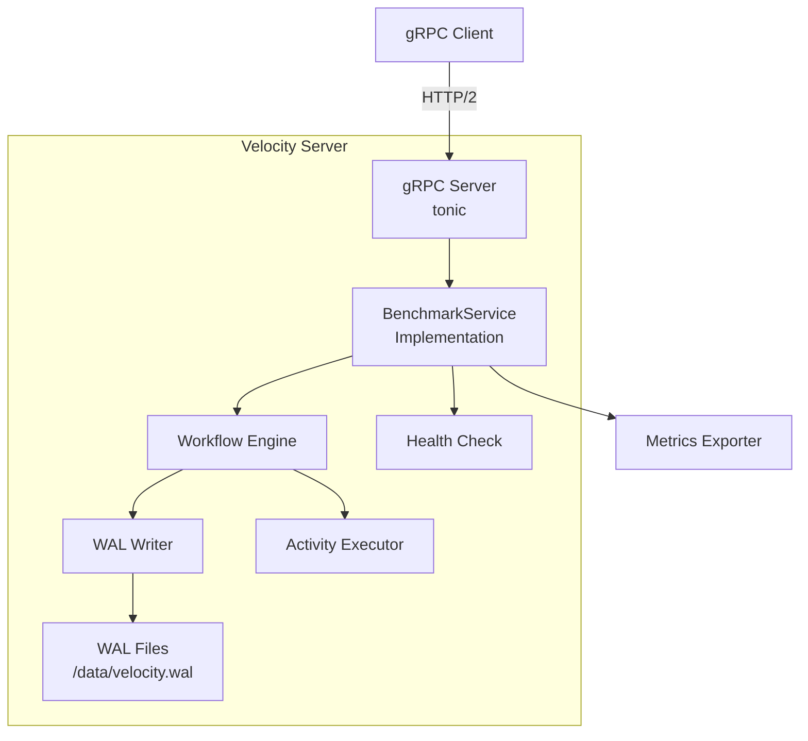
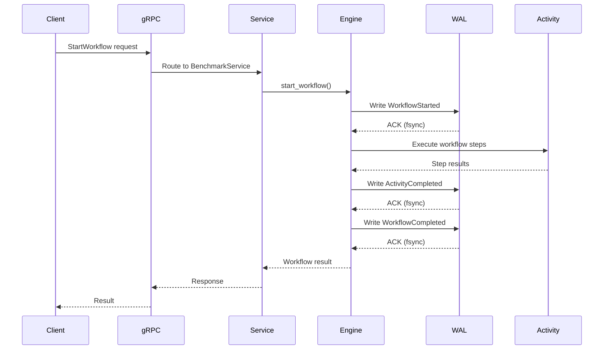
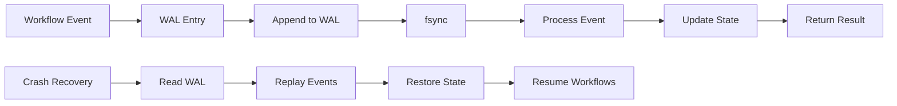

# Velocity Server (Single Binary)

<cite>
**Referenced Files in This Document**
- [velocity-workflow-server/src/main.rs](file://velocity-workflow-server/src/main.rs)
- [velocity-workflow-server/Cargo.toml](file://velocity-workflow-server/Cargo.toml)
- [velocity-workflow-engine/src/lib.rs](file://velocity-workflow-engine/src/lib.rs)
- [proto/bench/v1/bench.proto](file://proto/bench/v1/bench.proto)
- [Dockerfile](file://Dockerfile)
</cite>

## Table of Contents
1. [Overview](#overview)
2. [Architecture](#architecture)
3. [WAL Persistence](#wal-persistence)
4. [gRPC API](#grpc-api)
5. [Configuration](#configuration)
6. [Performance Characteristics](#performance-characteristics)
7. [Deployment](#deployment)
8. [Monitoring and Debugging](#monitoring-and-debugging)
9. [Use Cases](#use-cases)
10. [Limitations and Trade-offs](#limitations-and-trade-offs)

## Overview

Velocity Server is the **single-binary, gRPC-based** flavor of Velocity designed for maximum throughput with Write-Ahead Log (WAL) persistence with background group-commit optimization. It's the simplest deployment option with no external dependencies beyond the binary itself.

**Key Characteristics:**
- **Protocol:** gRPC (HTTP/2)
- **Persistence:** Write-Ahead Log (WAL) with background group-commit thread
- **Port:** 7234 (default), 17234 (Docker)
- **Memory:** ~98 MiB
- **Throughput:** 43.6 ops/s (simple workflow)
- **Latency:** p50=180ms, p99=332ms
- **Security:** API auth, rate limiting, audit logging, mTLS, security headers (via velocity-server-bootstrap)
- **Tracing:** OpenTelemetry with optional OTLP export
- **VCTP:** Shared VCTP RPC server (UDP :9090) with HMAC-SHA256 auth encryption, replay protection, 9,052 ops/s dispatch

**When to Use:**
- Maximum throughput requirements
- Simple deployment without external databases
- Crash recovery needed but no transactional guarantees
- Single-node deployments
- Edge computing scenarios

**When NOT to Use:**
- Need ACID transactions
- Require SQL queries on workflow state
- Multi-node clustering needed
- Complex search/filtering on workflow attributes

## Architecture

### Component Overview



### Request Flow



### WAL Architecture



**WAL Entry Structure:**
```rust
pub struct WalEntry {
    pub sequence: u64,           // Monotonic sequence number
    pub workflow_id: String,     // Workflow identifier
    pub run_id: String,          // Execution run identifier
    pub event_type: WalEventType,
    pub payload: Vec<u8>,        // Serialized event data
    pub timestamp: u64,          // Unix timestamp (microseconds)
    pub checksum: u32,           // CRC32 for integrity
}

pub enum WalEventType {
    WorkflowStarted,
    WorkflowCompleted,
    WorkflowFailed,
    ActivityScheduled,
    ActivityCompleted,
    ActivityFailed,
    SignalReceived,
    QueryExecuted,
    TimerScheduled,
    TimerFired,
}
```

## WAL Persistence

### Write Path

1. **Client Request** — gRPC request arrives at server
2. **Create WAL Entry** — Serialize event with metadata
3. **Append to WAL** — Write to end of current WAL file
4. **fsync** — Force write to disk (durability guarantee)
5. **Process Event** — Execute workflow/activity
6. **Write Completion** — Append completion entry to WAL
7. **Return Result** — Send response to client

### Recovery Path

1. **Startup** — Server starts, detects WAL files
2. **Read Entries** — Load all WAL entries in sequence order
3. **Verify Checksums** — Validate entry integrity
4. **Rebuild State** — Reconstruct workflow state from events
5. **Resume Workflows** — Continue in-progress workflows
6. **Ready** — Accept new requests

### WAL Configuration

```rust
pub struct WalConfig {
    /// Directory for WAL files
    pub path: PathBuf,              // Default: /data/velocity.wal
    
    /// Maximum size per WAL file before rotation
    pub max_file_size: u64,         // Default: 64MB
    
    /// fsync interval (0 = fsync every write)
    pub sync_interval: Duration,    // Default: 0 (always fsync)
    
    /// Enable zlib compression
    pub compression: bool,          // Default: false
    
    /// Number of WAL files to retain
    pub retention_count: usize,     // Default: 10
    
    /// Batch size for writes
    pub batch_size: usize,          // Default: 1
}
```

**Performance Tuning:**
- **sync_interval = 0** — Maximum durability, slower writes (~5ms per write)
- **sync_interval = 100ms** — Better throughput, risk of losing 100ms of data on crash
- **compression = true** — Smaller WAL files, CPU overhead
- **batch_size = 10** — Better throughput, higher latency

### Configurable Durability (DurabilityConfig)

Users pick their point on the safety-throughput curve:

```rust
pub struct DurabilityConfig {
    /// Number of steps between fsync calls. 0 = every step (strict).
    pub sync_steps: u32,
    /// Time-based floor: fsync at least this often even if step count not reached.
    pub flush_interval_ms: u64,
    /// Skip task queue enqueue on step completion. The caller drives steps directly
    /// instead of relying on external workers polling the task queue.
    pub direct_execution: bool,
}
```

| Mode | sync_steps | flush_interval_ms | direct_execution | Use Case |
|------|-----------|-------------------|------------------|----------|
| `strict()` | 0 | 0 | false | Financial transactions (lose nothing) |
| `batched(N, ms)` | N | ms | false | Order processing (lose ≤N steps) |
| `async_only(ms)` | u32::MAX | ms | false | Event processing (max throughput) |
| `with_direct_execution()` | N | ms | true | Embedded/engine-local (caller drives loop) |

**Direct Execution Mode:**
When `direct_execution = true`, step completion skips the task queue enqueue. This eliminates 2 Mutex locks + condvar signal per step for callers that drive the step loop themselves (tight `for` loop calling `complete_step_durable` sequentially).

**When to use**: embedded/engine-local workloads where the caller owns the loop.
**When NOT to use**: distributed worker-pool patterns where external workers poll the task queue.

**Bench server CLI flags:**
```bash
# Strict mode (default — fsync every step)
velocity-bench-server --sync-steps 0

# Batched mode (fsync every 10 steps or every 5ms)
velocity-bench-server --sync-steps 10 --flush-interval-ms 5

# Async mode (background fsync every 100ms)
velocity-bench-server --sync-steps 4294967295 --flush-interval-ms 100

# Direct execution mode (skip task queue, caller drives steps)
velocity-bench-server --sync-steps 10 --flush-interval-ms 5 --direct-execution
```

### WAL File Format

```
velocity.wal.000001
┌─────────────────────────────────────┐
│ Header (magic, version)             │
├─────────────────────────────────────┤
│ Entry 1: sequence=1, WorkflowStart  │
├─────────────────────────────────────┤
│ Entry 2: sequence=2, ActivitySched  │
├─────────────────────────────────────┤
│ Entry 3: sequence=3, ActivityCompl  │
├─────────────────────────────────────┤
│ ...                                 │
├─────────────────────────────────────┤
│ Footer (checksum, entry count)      │
└─────────────────────────────────────┘
```

## gRPC API

### Service Definition

```protobuf
service BenchmarkService {
  // Workflow lifecycle
  rpc StartWorkflow(StartWorkflowRequest) returns (StartWorkflowResponse);
  rpc SignalWorkflow(SignalWorkflowRequest) returns (SignalWorkflowResponse);
  rpc QueryWorkflow(QueryWorkflowRequest) returns (QueryWorkflowResponse);
  rpc CompleteStep(CompleteStepRequest) returns (CompleteStepResponse);
  rpc WaitForCompletion(WaitForCompletionRequest) returns (WaitForCompletionResponse);
  
  // Administrative
  rpc RegisterNamespace(RegisterNamespaceRequest) returns (RegisterNamespaceResponse);
  rpc HealthCheck(HealthCheckRequest) returns (HealthCheckResponse);
}
```

### Key RPCs

**StartWorkflow:**
```rust
async fn start_workflow(
    &self,
    request: Request<StartWorkflowRequest>,
) -> Result<Response<StartWorkflowResponse>, Status> {
    let req = request.into_inner();
    
    // Write to WAL first (durability)
    let entry = WalEntry {
        sequence: self.next_sequence(),
        workflow_id: req.workflow_id.clone(),
        run_id: generate_run_id(),
        event_type: WalEventType::WorkflowStarted,
        payload: serialize(&req)?,
        timestamp: now_micros(),
        checksum: 0,
    };
    
    self.wal.append(entry).await?;
    self.wal.fsync().await?;
    
    // Execute workflow
    let result = self.engine.execute_workflow(&req).await?;
    
    // Write completion
    let completion = WalEntry {
        event_type: WalEventType::WorkflowCompleted,
        payload: serialize(&result)?,
        ..entry
    };
    self.wal.append(completion).await?;
    
    Ok(Response::new(StartWorkflowResponse {
        workflow_id: req.workflow_id,
        run_id: result.run_id,
    }))
}
```

**SignalWorkflow:**
```rust
async fn signal_workflow(
    &self,
    request: Request<SignalWorkflowRequest>,
) -> Result<Response<SignalWorkflowResponse>, Status> {
    let req = request.into_inner();
    
    // Write signal to WAL
    let entry = WalEntry {
        event_type: WalEventType::SignalReceived,
        payload: serialize(&req)?,
        ..Default::default()
    };
    self.wal.append(entry).await?;
    
    // Deliver signal to workflow
    self.engine.deliver_signal(
        &req.workflow_id,
        &req.run_id,
        &req.signal_name,
        req.payload,
    ).await?;
    
    Ok(Response::new(SignalWorkflowResponse {}))
}
```

### Error Handling

```rust
impl From<WorkflowError> for Status {
    fn from(err: WorkflowError) -> Self {
        match err {
            WorkflowError::NotFound => Status::not_found(err.to_string()),
            WorkflowError::AlreadyExists => Status::already_exists(err.to_string()),
            WorkflowError::InvalidArgument => Status::invalid_argument(err.to_string()),
            WorkflowError::Internal(e) => Status::internal(e.to_string()),
            WorkflowError::WalError(e) => Status::unavailable(e.to_string()),
        }
    }
}
```

## Configuration

### Server Configuration

```toml
# velocity-server.toml
[server]
host = "0.0.0.0"
port = 7234
max_connections = 1000
keepalive_timeout = 300  # seconds

[wal]
path = "/data/velocity.wal"
max_file_size = 67108864  # 64MB
sync_interval = 0  # fsync every write
compression = false
retention_count = 10
batch_size = 1

[engine]
max_concurrent_workflows = 1000
max_concurrent_activities = 2000
activity_timeout = 300  # seconds
workflow_timeout = 3600  # seconds

[metrics]
enabled = true
export_interval = 10  # seconds
prometheus_port = 9090

[logging]
level = "info"  # trace, debug, info, warn, error
format = "json"  # json, text
```

### Environment Variables

```bash
# Server
VELOCITY_HOST=0.0.0.0
VELOCITY_PORT=7234
VELOCITY_MAX_CONNECTIONS=1000

# WAL
VELOCITY_WAL_PATH=/data/velocity.wal
VELOCITY_WAL_MAX_SIZE=67108864
VELOCITY_WAL_SYNC_INTERVAL=0
VELOCITY_WAL_COMPRESSION=false

# Engine
VELOCITY_MAX_WORKFLOWS=1000
VELOCITY_MAX_ACTIVITIES=2000
VELOCITY_ACTIVITY_TIMEOUT=300

# Metrics
VELOCITY_METRICS_ENABLED=true
VELOCITY_PROMETHEUS_PORT=9090

# Logging
RUST_LOG=info
```

## Performance Characteristics

### Throughput

| Workload | ops/s | p50 Latency | p99 Latency | Memory |
|----------|-------|-------------|-------------|--------|
| simple_workflow | 43.6 | 180ms | 332ms | 98 MiB |
| signal_storm | 5.4 | 735ms | 1254ms | 102 MiB |
| query_burst | 1.1 | 4536ms | 4759ms | 105 MiB |
| high_step | 29.0 | 130ms | 207ms | 99 MiB |
| concurrent_100 | 66.4 | 1391ms | 1531ms | 115 MiB |
| throughput_ceiling | 59.4 | 735ms | 3949ms | 120 MiB |

### Bottlenecks

1. **WAL group-commit** — Background thread batches fsync calls (~5ms per batch instead of per write)
2. **Single-threaded** — Workflow execution is sequential
3. **Memory allocation** — Payload serialization/deserialization
4. **gRPC overhead** — Protocol buffer serialization

### Optimization Strategies

**Increase Throughput:**
```toml
[wal]
sync_interval = 100  # Batch fsync every 100ms
batch_size = 10      # Batch 10 writes together
```

**Reduce Latency:**
```toml
[wal]
sync_interval = 0    # fsync every write (durability)
compression = false  # No CPU overhead
```

**Reduce Memory:**
```toml
[engine]
max_concurrent_workflows = 100   # Limit concurrency
max_concurrent_activities = 200
```

## Deployment

### Docker

```dockerfile
FROM rust:1.75-slim as builder
WORKDIR /build
COPY . .
RUN cargo build --release --bin velocity-server

FROM debian:bookworm-slim
RUN apt-get update && apt-get install -y ca-certificates
COPY --from=builder /build/target/release/velocity-server /usr/local/bin/
COPY --from=builder /build/velocity-workflow-server/config /etc/velocity/

EXPOSE 7234
VOLUME ["/data"]

CMD ["velocity-server", "--config", "/etc/velocity/velocity-server.toml"]
```

**Docker Compose:**
```yaml
version: '3.8'
services:
  velocity-server:
    build: .
    ports:
      - "17234:7234"
    volumes:
      - velocity-data:/data
      - ./config:/etc/velocity
    environment:
      - RUST_LOG=info
    deploy:
      resources:
        limits:
          cpus: "2.0"
          memory: 512M

volumes:
  velocity-data:
```

### Kubernetes

```yaml
apiVersion: apps/v1
kind: Deployment
metadata:
  name: velocity-server
spec:
  replicas: 1
  selector:
    matchLabels:
      app: velocity-server
  template:
    metadata:
      labels:
        app: velocity-server
    spec:
      containers:
      - name: velocity-server
        image: velocity-server:latest
        ports:
        - containerPort: 7234
        volumeMounts:
        - name: wal-storage
          mountPath: /data
        resources:
          requests:
            cpu: "1"
            memory: "256Mi"
          limits:
            cpu: "2"
            memory: "512Mi"
      volumes:
      - name: wal-storage
        persistentVolumeClaim:
          claimName: velocity-wal-pvc
---
apiVersion: v1
kind: Service
metadata:
  name: velocity-server
spec:
  selector:
    app: velocity-server
  ports:
  - port: 7234
    targetPort: 7234
  type: ClusterIP
---
apiVersion: v1
kind: PersistentVolumeClaim
metadata:
  name: velocity-wal-pvc
spec:
  accessModes:
    - ReadWriteOnce
  resources:
    requests:
      storage: 10Gi
  storageClassName: standard
```

### Bare Metal

```bash
# Build from source
cargo build --release --bin velocity-server

# Install binary
sudo cp target/release/velocity-server /usr/local/bin/
sudo mkdir -p /etc/velocity
sudo cp velocity-workflow-server/config/* /etc/velocity/

# Create data directory
sudo mkdir -p /data/velocity
sudo chown velocity:velocity /data/velocity

# Create systemd service
sudo tee /etc/systemd/system/velocity-server.service > /dev/null <<EOF
[Unit]
Description=Velocity Server
After=network.target

[Service]
Type=simple
User=velocity
Group=velocity
ExecStart=/usr/local/bin/velocity-server --config /etc/velocity/velocity-server.toml
Restart=always
RestartSec=10

[Install]
WantedBy=multi-user.target
EOF

# Start service
sudo systemctl daemon-reload
sudo systemctl enable velocity-server
sudo systemctl start velocity-server
```

## Monitoring and Debugging

### Metrics

**Prometheus Metrics:**
```
# Server metrics
velocity_server_requests_total{method="StartWorkflow"} 12345
velocity_server_request_duration_seconds{method="StartWorkflow",quantile="0.5"} 0.18
velocity_server_request_duration_seconds{method="StartWorkflow",quantile="0.99"} 0.33

# WAL metrics
velocity_wal_entries_written_total 54321
velocity_wal_bytes_written_total 123456789
velocity_wal_fsync_duration_seconds{quantile="0.5"} 0.005
velocity_wal_file_size_bytes 67108864

# Engine metrics
velocity_active_workflows 42
velocity_active_activities 87
velocity_workflow_completed_total 9876
velocity_workflow_failed_total 23
```

### Logging

**Log Levels:**
```bash
# Debug logging
RUST_LOG=debug velocity-server

# Trace logging (very verbose)
RUST_LOG=trace velocity-server

# Component-specific logging
RUST_LOG=velocity_server=debug,velocity_engine=info velocity-server
```

**Example Logs:**
```json
{"timestamp":"2026-08-14T19:28:01.520Z","level":"INFO","message":"Velocity Server starting","version":"1.0.0","port":7234}
{"timestamp":"2026-08-14T19:28:01.521Z","level":"INFO","message":"WAL initialized","path":"/data/velocity.wal","max_size":67108864}
{"timestamp":"2026-08-14T19:28:01.522Z","level":"INFO","message":"Server listening","address":"0.0.0.0:7234"}
{"timestamp":"2026-08-14T19:28:05.123Z","level":"DEBUG","message":"Workflow started","workflow_id":"wf-123","run_id":"run-456"}
```

### Debugging

**Enable Debug Mode:**
```bash
RUST_LOG=debug RUST_BACKTRACE=1 velocity-server
```

**Inspect WAL:**
```bash
# List WAL files
ls -lh /data/velocity.wal*

# View WAL entries (if tool available)
velocity-wal-dump /data/velocity.wal.000001

# Check WAL integrity
velocity-wal-check /data/velocity.wal.000001
```

**Performance Profiling:**
```bash
# CPU profiling
cargo flamegraph --bin velocity-server

# Memory profiling
valgrind --tool=massif target/release/velocity-server

# strace for I/O analysis
strace -e trace=write,fsync -p $(pgrep velocity-server)
```

## Use Cases

### Ideal Use Cases

1. **High-Throughput Event Processing**
   - Stream processing with durable execution
   - Event-driven architectures
   - Real-time data pipelines

2. **Edge Computing**
   - Single-node deployments at edge locations
   - No external database dependencies
   - Crash recovery for unreliable hardware

3. **Microservices Orchestration**
   - Coordinating distributed services
   - Saga pattern implementation
   - Transactional workflows

4. **Batch Processing**
   - Large-scale batch jobs
   - Parallel workflow execution
   - Progress tracking and recovery

5. **IoT Device Coordination**
   - Managing device fleets
   - Firmware update orchestration
   - Data collection workflows

### Example: Event Processing Pipeline

```rust
// Define workflow
#[workflow]
async fn process_event(event: Event) -> Result<(), Error> {
    // Step 1: Validate event
    let validated = validate_event(event).await?;
    
    // Step 2: Transform data
    let transformed = transform_data(validated).await?;
    
    // Step 3: Enrich with external data
    let enriched = enrich_data(transformed).await?;
    
    // Step 4: Store results
    store_results(enriched).await?;
    
    // Step 5: Notify downstream
    notify_downstream(enriched.id).await?;
    
    Ok(())
}

// Start workflow
let client = VelocityClient::connect("http://localhost:7234").await?;
let (workflow_id, run_id) = client.start_workflow(
    "process_event",
    event,
).await?;

// Wait for completion
let result = client.wait_for_completion(&workflow_id, &run_id).await?;
```

## Limitations and Trade-offs

### Limitations

1. **Single Node**
   - No horizontal scaling
   - Single point of failure
   - Limited by single machine resources

2. **No ACID Transactions**
   - WAL provides durability but not transactional guarantees
   - No cross-workflow transactions
   - No rollback on partial failures

3. **No SQL Queries**
   - Cannot query workflow state with SQL
   - Limited search/filtering capabilities
   - No joins or aggregations

4. **Sequential Execution**
   - Workflows execute sequentially (no parallelism)
   - Limited by single CPU core
   - Activity parallelism within workflow

5. **WAL Growth**
   - WAL files grow unbounded without cleanup
   - Requires manual rotation/compaction
   - Disk space management needed

### Trade-offs

| Aspect | Velocity Server | Velocity Embedded | Trade-off |
|--------|----------------|-------------------|----------|
| Throughput | Higher (43.6 ops/s) | Lower (61.25 ops/s) | WAL vs PostgreSQL overhead |
| Latency | Higher (180ms p50) | Lower (14.65ms p50) | group-commit vs connection pool |
| Memory | Higher (98 MiB) | Lower (1.25 MiB) | WAL buffers vs connection pool |
| Durability | WAL (crash recovery) | PostgreSQL (ACID) | Simplicity vs transactional |
| Queryability | None | Full SQL | Performance vs flexibility |
| Scalability | Single node | Multi-instance (PG advisory) | Both limited to single node |

### When to Choose Alternatives

**Choose Velocity Embedded when:**
- Need ACID transactions
- Require SQL queries on workflow state
- Want lower memory footprint
- Need connection pooling

**Choose Velocity Classic when:**
- Migrating from Temporal
- Need TypeScript-native workflows
- Want in-memory performance
- Don't need durability

**Choose Temporal when:**
- Need multi-node clustering
- Require advanced features (schedules, cron workflows)
- Need strong consistency guarantees
- Have complex orchestration requirements

## Conclusion

Velocity Server excels at **high-throughput, single-node deployments** where crash recovery is needed but ACID transactions are not. It's the simplest flavor to deploy and operate, making it ideal for edge computing, event processing, and microservices orchestration.

**Key Strengths:**
- Simple deployment (single binary)
- Crash recovery via WAL
- Good throughput for single node
- No external dependencies

**Key Weaknesses:**
- No horizontal scaling
- No ACID transactions
- No SQL queries
- Higher latency than Embedded

**Section sources**
- [velocity-workflow-server/src/main.rs](file://velocity-workflow-server/src/main.rs)
- [velocity-workflow-engine/src/lib.rs](file://velocity-workflow-engine/src/lib.rs)
- [proto/bench/v1/bench.proto](file://proto/bench/v1/bench.proto)
